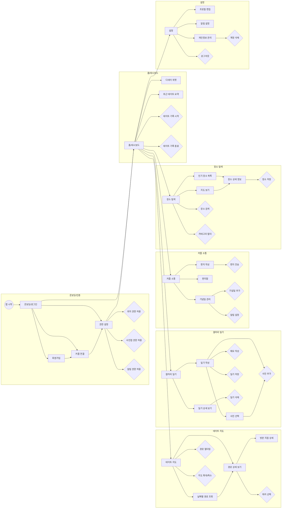

```mermaid
flowchart LR

  subgraph s1 ["온보딩/인증"]
    n1(("앱 시작"))
    n2["온보딩/로그인"]
    n3["회원가입"]
    n4["커플 연결"]
    n5["권한 설정"]
    n6{"위치 권한 허용"}
    n7{"사진첩 권한 허용"}
    n8{"알림 권한 허용"}
  end

  subgraph s2 ["홈/대시보드"]
    n9["홈/대시보드"]
    n10["디데이 위젯"]
    n11["최근 데이트 요약"]
    n12{"데이트 기록 시작"}
    n13{"데이트 기록 종료"}
  end

  subgraph s3 ["데이트 지도"]
    n14["데이트 지도"]
    n15["경로 상세 보기"]
    n16["날짜별 경로 조회"]
    n17["방문 지점 상세"]
    n18{"경로 필터링"}
    n19{"지도 확대/축소"}
    n20{"마커 선택"}
  end

  subgraph s4 ["갤러리 일기"]
    n21["갤러리 일기"]
    n22["일기 작성"]
    n23["일기 상세 보기"]
    n24["사진 선택"]
    n25{"사진 추가"}
    n26{"메모 작성"}
    n27{"일기 저장"}
    n28{"일기 삭제"}
  end

  subgraph s5 ["커플 소통"]
    n29["커플 소통"]
    n30["편지 작성"]
    n31["편지함"]
    n32["기념일 관리"]
    n33{"편지 전송"}
    n34{"기념일 추가"}
    n35{"알림 설정"}
  end

  subgraph s6 ["장소 탐색"]
    n36["장소 탐색"]
    n37["인기 장소 목록"]
    n38["장소 상세 정보"]
    n39["지도 보기"]
    n40{"장소 검색"}
    n41{"카테고리 필터"}
    n42{"장소 저장"}
  end

  subgraph s7 ["설정"]
    n43["설정"]
    n44["프로필 편집"]
    n45["알림 설정"]
    n46["개인정보 관리"]
    n47{"로그아웃"}
    n48{"계정 삭제"}
  end

  n1 --> n2
  n2 --> n3
  n2 --> n4
  n2 --> n5
  n2 --> n9
  n3 --> n4
  n4 --> n5
  n5 --> n6
  n5 --> n7
  n5 --> n8
  n5 --> n9
  n9 --> n10
  n9 --> n11
  n9 --> n12
  n9 --> n13
  n9 --> n14
  n9 --> n21
  n9 --> n29
  n9 --> n36
  n9 --> n43
  n14 --> n15
  n14 --> n16
  n14 --> n18
  n14 --> n19
  n15 --> n17
  n15 --> n20
  n16 --> n15
  n21 --> n22
  n21 --> n23
  n22 --> n24
  n22 --> n25
  n22 --> n26
  n22 --> n27
  n23 --> n28
  n24 --> n25
  n29 --> n30
  n29 --> n31
  n29 --> n32
  n30 --> n33
  n32 --> n34
  n32 --> n35
  n36 --> n37
  n36 --> n39
  n36 --> n40
  n36 --> n41
  n37 --> n38
  n38 --> n42
  n39 --> n38
  n43 --> n44
  n43 --> n45
  n43 --> n46
  n43 --> n47
  n46 --> n48
```
