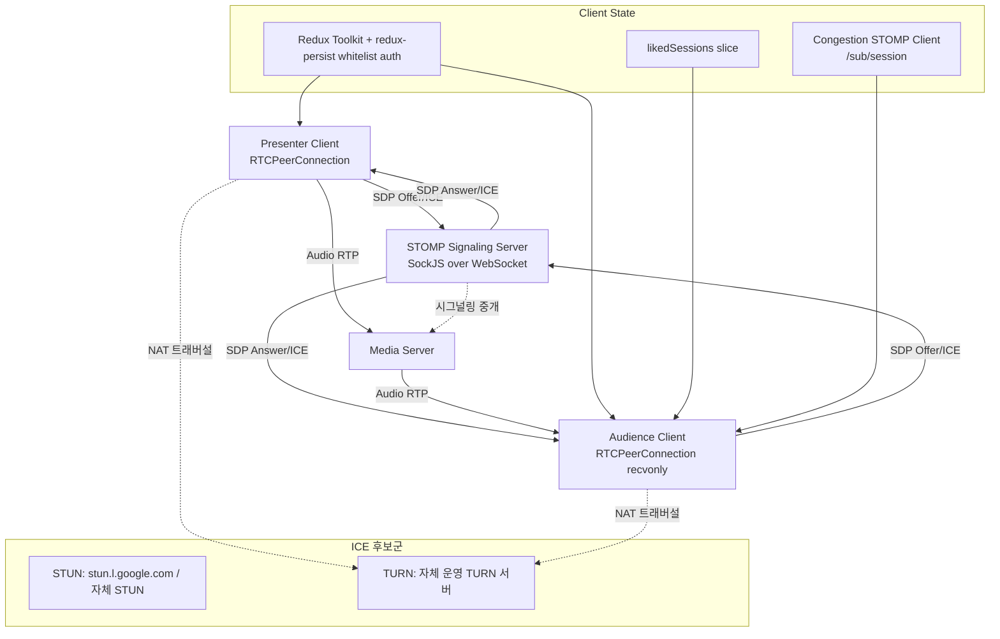
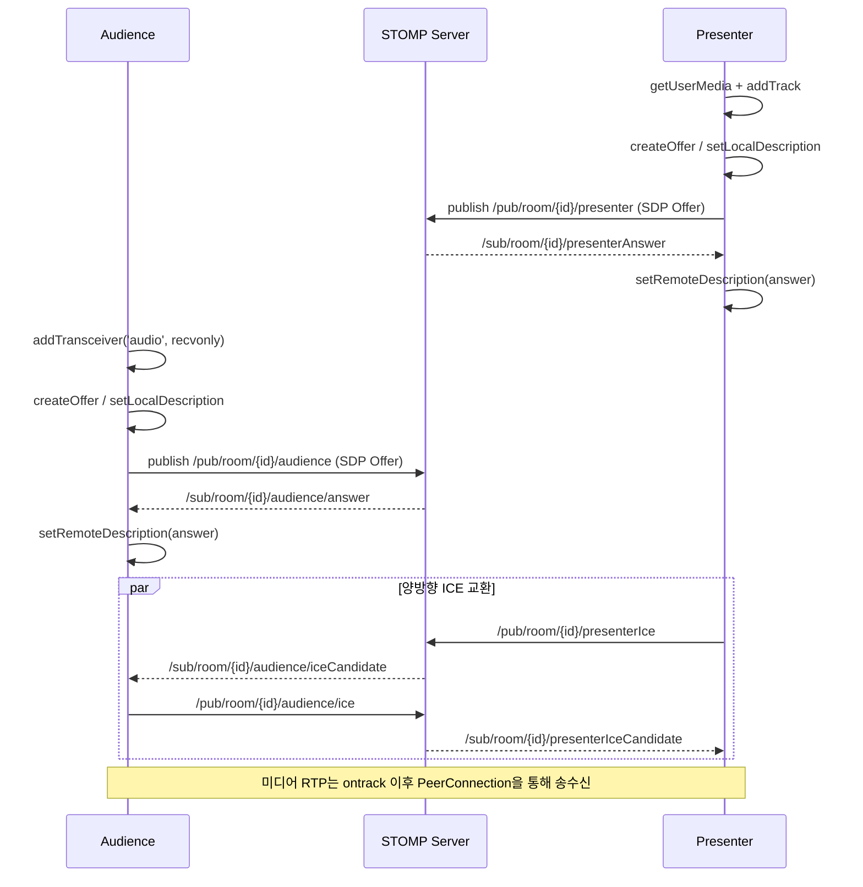

## [FiT] - WebRTC 시그널링을 직접 구현한 사일런트 컨퍼런스 플랫폼

### 전체적인 아키텍처

- **Architecture**: Vite와 React 환경에서 RTCPeerConnection API를 라이브러리 래퍼 없이 직접 사용하여, 발표자와 청중이 각각 미디어 서버와 1:N으로 연결되는 WebRTC 구조를 클라이언트 측에서 구현했습니다.
- 시그널링은 SockJS 위의 STOMP 프로토콜에 직접 정의했으며, 발표자는 `/pub/room/{id}/presenter`로 청중은 `/pub/room/{id}/audience`로 SDP 오퍼와 ICE를 publish하고 각자의 응답 토픽을 subscribe하여 양방향 협상을 완료합니다.
- 청중은 `pc.addTransceiver('audio', { direction: 'recvonly' })`로 수신 전용 트랜시버를 명시하여 SDP 협상 비용을 최소화했고, NAT 환경 대응을 위해 자체 운영 TURN 서버를 ICE 후보군에 함께 등록했습니다.
- 인증 토큰과 좋아요 세션 목록은 Redux Toolkit으로 관리하고 redux-persist whitelist에 auth만 포함하여 보안과 영속성을 함께 확보했습니다.

### Case 1. SDP 협상 이전에 도착한 ICE 후보를 큐잉하여 연결 안정성 확보
#### 1. 문제 원인
- 시그널링 초기 구현에서는 SDP 응답을 받기 전에 ICE 후보가 먼저 도착하면 `setRemoteDescription`이 호출되지 않은 PeerConnection에 `addIceCandidate`를 시도하면서 예외가 발생했습니다.
- 후보가 한 번이라도 유실되면 NAT 트래버설이 실패하여 미디어 트랙이 붙지 않는 무음 상태가 재현되었고, 실패 시 별다른 복구 경로가 없어 사용자가 페이지를 새로고침해야 했습니다.
- 원인은 STOMP `presenterAnswer`/`audience/answer` 메시지와 `presenterIceCandidate`/`audience/iceCandidate` 메시지의 도착 순서가 보장되지 않는다는 점에 있었습니다.

#### 2. 해결 과정
- 발표자와 청중 컴포넌트 양쪽에 `pendingCandidates`라는 `useRef` 큐를 두고, ICE 메시지를 수신했을 때 `pcRef.current.remoteDescription`이 아직 비어 있으면 즉시 추가하지 않고 큐에 적재하도록 했습니다.
- SDP Answer 수신 시점의 `setRemoteDescription` 콜백 안에서 큐에 쌓인 후보를 순서대로 `addIceCandidate`로 flush하고 큐를 비우는 흐름을 구성하여, 메시지 도착 순서와 무관하게 후보가 유실되지 않도록 했습니다.
- 큐를 컴포넌트 로컬 ref로 둔 이유는 PeerConnection 자체가 컴포넌트 단위의 라이프사이클을 가지기 때문이며, 전역 스토어에 두면 라우팅 전환이나 언마운트 시 잔여 후보가 다음 세션으로 누수될 위험이 있었습니다.

#### 3. 결과
- **성과**: SDP와 ICE 도착 순서 역전으로 인한 초기 연결 실패가 사라졌고, 발표자/청중 양측의 PeerConnection이 ICE Connected 상태로 일관되게 도달했습니다.
- **배운 점**: 컴포넌트 ref에 ICE 큐를 두고 `setRemoteDescription` 직후 flush하도록 코드 경계를 설정한 결과, STOMP 메시지 도착 순서가 흔들려도 후보 유실 없이 NAT 트래버설이 완료됐습니다.

### Case 2. 혼잡도 데이터를 시그널링과 분리하기 위한 STOMP 채널 이중화
#### 1. 문제 원인
- 사일런트 컨퍼런스는 다수 채널이 병렬로 진행되기 때문에 청중이 어떤 세션이 붐비는지 실시간으로 보지 못하면 채널 이동 의사결정이 막혔고, 혼잡도 정보가 시그널링 흐름과 분리되어 있어야 운영 화면이 끊김 없이 갱신될 수 있었습니다.
- 그러나 채팅 STOMP 클라이언트 하나에 혼잡도 토픽을 함께 묶으면 채팅 메시지가 몰리는 구간에서 혼잡도 수신이 밀리거나, 반대로 혼잡도 브로드캐스트가 채팅 채널을 점유할 위험이 있었습니다.

#### 2. 해결 과정
- 혼잡도 전용 STOMP 클라이언트(`api/congestion/congestion-stomp-client.js`)를 별도로 구성하여 같은 SockJS 엔드포인트 위에 독립된 STOMP 세션을 띄우고, `/sub/session` 토픽 하나만 구독하도록 책임 범위를 좁혔습니다.
- 채팅 STOMP 클라이언트와 동일한 `reconnectDelay: 5000`, `heartbeatIncoming/Outgoing: 4000` 파라미터를 적용하여 두 채널이 같은 회복 정책을 가지면서도 서로의 트래픽 폭증에 영향을 받지 않도록 격리했습니다.
- 채널을 둘로 나누면서 메시지 도메인 자체를 분리할 수 있게 되어, 혼잡도 데이터는 화면 갱신 콜백으로 바로 흘려보내고 채팅 메시지는 채팅 렌더링 로직에 집중하도록 클라이언트 측 책임을 명확히 했습니다.

#### 3. 결과
- **성과**: 채팅과 혼잡도가 서로 다른 STOMP 세션을 통해 흐르게 되어 한쪽 트래픽이 폭증해도 다른 쪽이 영향을 받지 않는 구조가 마련되었고, 청중 화면에 채널별 인원 변동을 별도 라인으로 실시간 반영할 수 있게 되었습니다.
- **배운 점**: 같은 SockJS 엔드포인트 위에 STOMP 세션을 두 개로 분리하고 동일한 재연결·heartbeat 파라미터를 적용한 결과, 채팅 트래픽이 몰리는 구간에서도 혼잡도 화면이 밀리지 않고 운영자가 채널별 인원 변동을 별도 라인에서 추적할 수 있게 됐습니다.

### Case 3. 행사장 네트워크 변동에 대비한 STOMP 재연결과 heartbeat 설정
#### 1. 문제 원인
- 행사장의 Wi-Fi와 모바일 망은 일시적으로 끊기는 일이 잦았고, 끊긴 STOMP 세션이 재연결되지 않으면 실시간 채팅과 세션별 혼잡도 표시가 청중에게 닿지 않는 현상이 발생했습니다.
- 기본 STOMP 설정 상태에서는 WebSocket이 끊어진 뒤 클라이언트가 알아채는 시점이 늦어 좀비 커넥션이 유지되었고, 끊김을 감지하더라도 수동으로 재연결을 트리거해야 해서 사용자 입장에서는 페이지를 새로고침하지 않으면 복구되지 않았습니다.

#### 2. 해결 과정
- 채팅·혼잡도 STOMP 클라이언트(`api/chat/stomp-client.js`·`api/congestion/congestion-stomp-client.js`)에 `reconnectDelay: 5000`을 각각 지정하여 연결이 끊긴 뒤 5초 후 자동으로 재연결 시도가 이뤄지도록 했고, 새 세션에서도 등록해 둔 토픽 구독이 자동으로 복원되도록 구독 캐시를 함께 두었습니다.
- `heartbeatIncoming: 4000`과 `heartbeatOutgoing: 4000`을 함께 설정하여 4초 간격의 양방향 heartbeat로 좀비 커넥션을 빠르게 감지하고, 네트워크 단절을 STOMP 레벨에서 명시적으로 인지하도록 했습니다.
- 재연결 이후에도 권한이 유지되도록 인증 토큰을 `connectHeaders`와 각 `subscribe` 호출 헤더에 모두 `Bearer` 형식으로 실어 보내, 백엔드 인터셉터의 토큰 검증 흐름과 정합성을 맞췄습니다.

#### 3. 결과
- **성과**: 일시적 네트워크 변동에서도 채팅·혼잡도 STOMP 세션이 자동으로 복구되어 두 채널 흐름이 끊기지 않게 되었고, 사용자가 페이지를 새로고침하지 않아도 청취가 이어지는 동작을 확보했습니다.
- **배운 점**: `reconnectDelay: 5000`과 4초 양방향 heartbeat를 STOMP 클라이언트에 직접 지정한 뒤, 행사장 Wi-Fi가 일시 단절돼도 좀비 커넥션이 5초 안에 정리되고 새 세션에서 구독이 자동 복원되어 사용자가 새로고침 없이 청취를 이어갔습니다.

### Case 4. STOMP 위에 WebRTC 시그널링을 직접 구현하여 저지연 오디오 송수신을 구성
#### 1. 문제 원인
- 사일런트 컨퍼런스는 같은 공간에서 무선 헤드폰으로 발표를 청취하는 형태라, 발표자의 입모양과 오디오 사이의 싱크가 어긋나면 체감 경험이 무너집니다.
- HLS/RTMP 계열의 라이브 스트리밍은 수 초 이상의 버퍼링 지연이 발생하기 때문에 현장 청취 용도로 부적합했고, 수백 밀리초 단위의 RTT가 보장되는 WebRTC 기반 구성이 필요했습니다.
- 사내 인프라에는 별도의 WebRTC SDK가 없었고, 시그널링 채널을 새로 정의하면서 발표자와 청중 양측의 PeerConnection 라이프사이클을 클라이언트에서 직접 관리해야 했습니다.

#### 2. 해결 과정

- 발표자 클라이언트에서 `getUserMedia`로 마이크 스트림을 받아 `addTrack`으로 PeerConnection에 부착하고, `createOffer`/`setLocalDescription`으로 만든 SDP를 STOMP `/pub/room/{id}/presenter` 토픽에 publish하도록 구성했습니다.
- 청중 클라이언트는 음성 송출이 필요하지 않으므로 `pc.addTransceiver('audio', { direction: 'recvonly' })`로 수신 전용 트랜시버를 추가한 뒤 별도 PeerConnection을 만들어 `/pub/room/{id}/audience`로 오퍼를 보냈습니다.
- `onicecandidate` 콜백에서 생성되는 ICE 후보는 발표자/청중 각각 `/pub/room/{id}/presenterIce`, `/pub/room/{id}/audience/ice` 토픽으로 양방향 publish하여 서버 중개 시그널링을 완성했습니다.
- 자체 운영 중인 TURN 서버와 자체 STUN, 공용 STUN을 `iceServers` 배열에 함께 등록하여 행사장 NAT 환경에서도 연결률이 떨어지지 않도록 했습니다.

#### 3. 결과
- **성과**: 발표자와 청중이 동일한 STOMP 채널 위에서 SDP와 ICE를 교환하는 1:N 오디오 스트리밍 구성을 완성했으며, RTCPeerConnection의 RTP 전송 특성상 HLS 대비 체감 지연이 크게 줄어 현장 청취 경험을 확보했습니다.
- **배운 점**: SDK 없이 발표자/청중 PeerConnection 라이프사이클을 직접 관리하고 SDP 오퍼·앤서와 ICE 후보 교환 토픽을 STOMP에 정의한 결과, 시그널링 프로토콜과 미디어 RTP 전송 경로를 분리해서 다루는 작업 흐름을 갖게 됐습니다.
