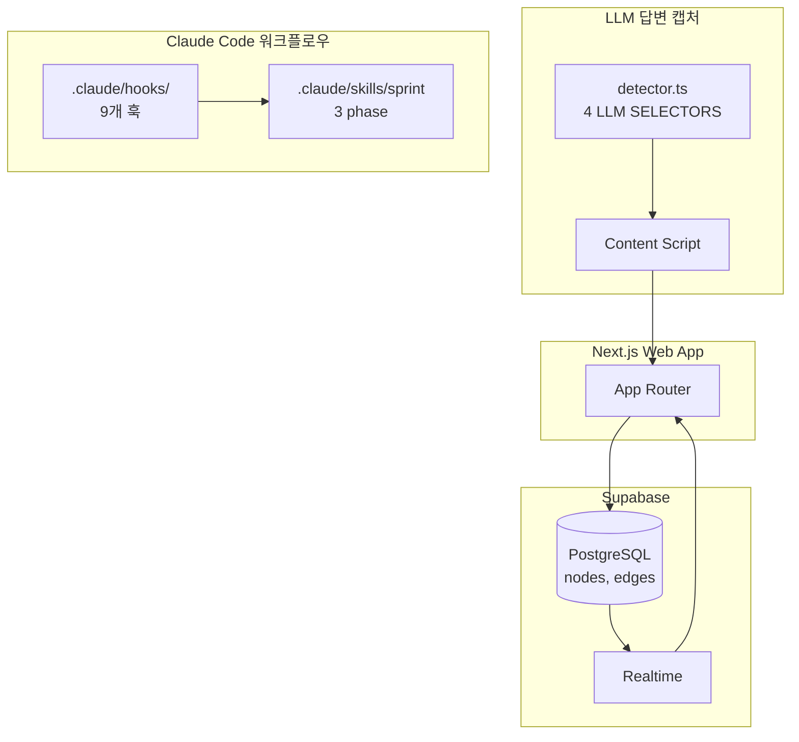
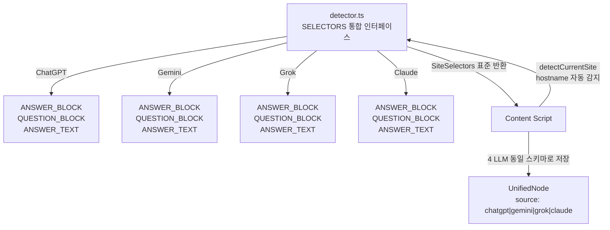
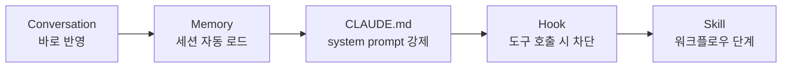
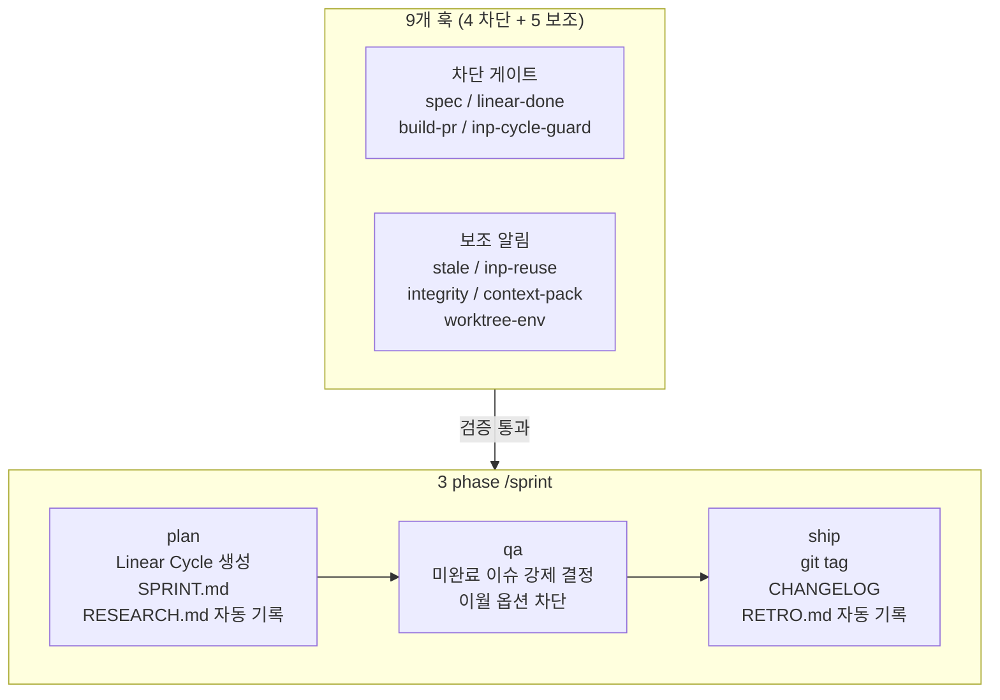
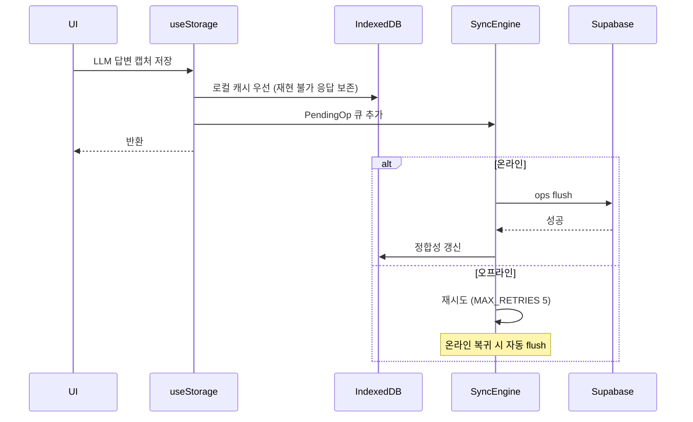

## [MindGraph] - AI 지식 캡처 & 그래프 시각화

ChatGPT·Gemini·Claude·Grok 4개 LLM 서비스의 답변을 hostname 자동 감지로 캡처해 동일 스키마(UnifiedNode)로 통합 저장하는 LLM 데이터 도구입니다. Claude Code 위에 9개 훅(하네스)과 plan·qa·ship 3 phase /sprint 워크플로우, 5층 컨텍스트 영속화를 직접 설계해 에이전트가 잘 동작하도록 환경 자체를 코드화한 컨텍스트 엔지니어링·하네스 엔지니어링 사례이며, 도메인 getmindgraph.com 등록 후 출시 전 1인 프로토타입 단계입니다.

### 전체적인 아키텍처

- **Architecture**: LLM 답변 캡처(Extension)와 통합 데이터 저장(UnifiedNode·Supabase), AI 협업 운영(Claude Code 9 훅·3 phase sprint)이 한 시스템 안에서 연결됩니다.

### Case 1. 4개 LLM 서비스 통합 표면을 단일 지점으로 추상화

#### 1. 문제 원인

- ChatGPT(OpenAI)·Gemini(Google)·Grok(xAI)·Claude(Anthropic) 4개 LLM 서비스가 각자 다른 응답 DOM 구조를 가지고 있고 사전 공지 없이 자주 바뀌어, 4개 서비스의 응답을 한 시스템에서 통합 캡처하려면 표준 인터페이스로 묶는 통합 레이어가 필요했습니다.
- 초기에는 서비스별 선택자가 여러 파일에 분산되어 한 서비스 DOM 변경이 다수 파일 수정으로 이어졌고, 새 LLM 서비스를 추가하는 비용도 함께 늘었습니다.

#### 2. 해결 과정

- **선택자 통합 인터페이스**: 4개 LLM 서비스의 답변 영역 DOM 선택자를 `detector.ts`의 `SELECTORS` 상수에 `ANSWER_BLOCK`·`QUESTION_BLOCK`·`ANSWER_TEXT` 표준 키로 모아, 서비스별 차이를 단일 인터페이스로 추상화했습니다.
- **hostname 자동 감지**: `detectCurrentSite()`가 `window.location.hostname` 기반으로 현재 LLM 서비스를 식별해 올바른 선택자를 반환합니다. 사용자가 서비스를 수동 선택할 필요가 없습니다.
- **UnifiedNode `source` 필드**: 캡처한 답변은 `source: 'chatgpt' | 'gemini' | 'grok' | 'claude'` 필드를 포함해 동일 스키마로 저장되어, 이후 후속 처리가 LLM 서비스 구분 없이 동작합니다.
- **새 LLM 서비스 추가 경로**: SELECTORS 상수에 새 항목을 추가하면 Content Script·UnifiedNode가 그대로 동작하는 단방향 확장 구조를 유지했습니다.

#### 3. 결과

- **성과**: 4개 LLM 서비스의 응답 DOM 변경에 대응할 때 수정 범위가 `detector.ts` 상수 한 곳으로 한정되었고, 새 LLM 서비스를 추가할 때도 SELECTORS 등록 하나로 시스템 전체가 통합되도록 LLM 통합 표면을 단일화했습니다.
- **배운 점**: 다중 LLM 통합 시스템에서는 각 서비스 응답 표현(DOM) 차이를 한 곳에 모아 표준 인터페이스로 추상화하는 통합 레이어 설계가 핵심이고, SELECTORS 상수 한 곳 수정만으로 4개 LLM 서비스 응답 DOM 변경에 대응할 수 있게 되었습니다.

### Case 2. 컨텍스트 엔지니어링·하네스 엔지니어링: Claude Code 위 9 훅(하네스) + 3 phase sprint + 5층 컨텍스트 영속화

#### 1. 문제 원인

- Claude Code를 도구로만 쓰면 세션 간 컨텍스트가 초기화되어 같은 규칙·교정을 LLM에게 반복 설명하는 프롬프트 비용이 누적되었고, 이는 LLM 활용 효율을 결정하는 본질 문제였습니다.
- AI가 사용자 확인 없이 commit 생성·이슈 완료 처리·cycle 이월 같은 자율 행동을 해서, LLM 출력 검증을 시스템 수준에서 강제하지 않으면 잘못된 출력이 그대로 main 브랜치에 머지될 위험이 있었습니다.
- 코드·이슈·문서·배포 기록 네 시스템이 같은 정보를 중복 관리해, LLM이 현재 상태를 정확히 파악 못 한 채 응답을 생성하는 컨텍스트 부족 문제가 누적되었습니다.

#### 2. 해결 과정

- **5층 컨텍스트 영속화**: Conversation·Memory·CLAUDE.md·Hook·Skill 5층에 규칙을 분산해, 교정이 바로 반영되고 다음 세션에 자동 로드되며 매 세션 system prompt에 강제되고 도구 호출 시 차단되며 워크플로우 단계로 구조화되도록 했습니다. 이는 LLM 컨텍스트 엔지니어링을 코드 자산으로 정착시킨 사례입니다.
- **9개 훅 검증 게이트**: 차단 게이트 4개(`spec-gate.sh`로 스펙 미승인 시 코드 작성 차단, `linear-done-gate.sh`로 사용자 승인 전 이슈 완료 차단, `build-pr-block.sh`로 워커 브랜치 PR 차단, `inp-cycle-guard.sh`로 active cycle 외 이슈 cycle 이동 차단)와 보조 알림 5개(`stale-warn.sh`, `inp-reuse-suggest.sh`, `integrity-sync.sh`, `context-pack-stale.sh`, `worktree-env-symlink.sh`)로 분류해 LLM 출력 검증을 시스템 수준에서 강제합니다.
- **/sprint 메타 스킬 3 phase**: plan(Linear Cycle 생성·SPRINT.md 작성·RESEARCH.md 자동 기록), qa(미완료 이슈를 완료 또는 archive로 강제, 이월 옵션 mechanism 차단), ship(git tag·CHANGELOG·RETRO.md 자동 기록)을 단일 명령으로 연결하고, 각 phase 진입 전 이전 산출물 존재 여부를 검증해 LLM에 일관된 컨텍스트가 단계별로 주어지도록 강제합니다.
- **4중 SSOT**: SPRINT.md·Linear Cycle·Git·CHANGELOG 네 시스템에 역할 하나씩만 부여해 LLM이 항상 단일 진실 원천에서 컨텍스트를 받도록 했습니다.
- **부서·에이전트 분리 + context-map 자동 라우팅**: 7개 부서(design·dev·docs·marketing·ops·product·qa)와 9개 에이전트(ceo·frontend/backend/qa-engineer·product-manager·ui-ux-designer·marketing-strategist·ops-engineer·knowledge-logger)별로 `department/{팀}/CLAUDE.md`와 `docs/` lifecycle 폴더(active/playbook/artifacts/drafts/archive)를 분리하고, `RULES/context-map.md` 정책 doc과 `SYSTEM/schemas/code-doc-mapping.yaml` 매핑 데이터로 task_type별 분류(new_feature·ui_change·api_change·bug_fix·refactor 등) 및 코드 path glob(예: `storage/**` 변경 시 `DATABASE_SCHEMA.md`·`BACKEND.md`·`STATE_MANAGEMENT.md`)을 must-read doc에 자동 매핑했습니다. CEO 에이전트가 워커(frontend-engineer·backend-engineer·qa-engineer)에 위임할 때 task_types.must_read와 path_mappings 합집합만 prompt에 첨부되어, 전 부서 docs 끌어오기를 5개 내외 doc 첨부로 줄였습니다. `scripts/docs/validate.ts`의 `validateContextMap()`이 must-read 실재성을 검증해 라우팅이 깨지지 않도록 했습니다.

#### 3. 결과

- **성과**: 이슈 등록·SPRINT.md·CHANGELOG·Git 태그·Linear Done 같은 sprint 라이프사이클 반복 작업을 9개 훅과 `/sprint` 3 phase로 자동화해 LLM이 정확한 컨텍스트를 받아 검증된 출력을 만드는 운영 사이클을 코드화했습니다.
- **배운 점**: Conversation·Memory·CLAUDE.md·Hook·Skill 5층과 9개 훅, /sprint 3 phase, 4중 SSOT를 코드로 두면서, sprint 라이프사이클 반복 작업과 검증 게이트가 사용자 확인 없이 자율 실행되는 위험을 같은 코드 경로에서 처리하게 되었습니다.

### Case 3. LLM 응답 데이터 무손실 동기 파이프라인

#### 1. 문제 원인

- LLM 답변은 모델 응답이라 같은 프롬프트로도 다시 동일하게 재현되지 않을 수 있어, 한 번 캡처한 결과를 잃지 않는 무손실 저장 정책이 LLM 데이터 파이프라인에 필수였습니다.
- LLM 답변이 네트워크 단절로 유실되면 사용자가 다시 LLM에게 같은 프롬프트를 던져 응답을 받아야 했고, 이는 LLM 호출 비용과 사용자 시간을 동시에 낭비하는 데이터 무결성 문제였습니다.
- Supabase RLS 정책 적용 중 오프라인 상태 인증 토큰 만료 변수까지 함께 처리해야 해, 단순 캐시가 아닌 시스템 결정이 필요했습니다.

#### 2. 해결 과정

- **로컬 캐시 우선 저장**: 캡처한 LLM 답변을 IndexedDB에 먼저 쓰는 Write-Behind 방식으로 LLM 호출과 저장을 분리해 재현 불가한 응답을 네트워크 상태와 무관하게 보존합니다.
- **Pending Ops 큐**: `sync-engine.ts`의 `addPendingOps`와 `flushPendingOps`가 동기화 실패를 큐로 흡수하고, 온라인 복귀 시 자동으로 flush됩니다.
- **재시도 한도**: `MAX_RETRIES = 5` 상수로 무한 재시도를 방지하고 초과 시 `status: 'failed'`로 마킹해 재시도 비용 폭발을 차단했습니다.
- **Realtime 통합**: Supabase Realtime이 다른 디바이스에서 캡처된 LLM 답변을 현재 디바이스 캐시에 자동 반영합니다.
- **캐시 분리**: 클라우드 캐시(`mindgraph-cloud-cache`)와 로컬 데이터(`mindgraph-web`)를 별도 IndexedDB로 두어 로그아웃 시 클라우드만 비우고 비로그인 사용자 LLM 답변은 로컬에 유지됩니다.

#### 3. 결과

- **성과**: 오프라인 상태에서 LLM 답변 캡처가 동작하고 온라인 복귀 시 큐가 자동 flush되며, 같은 LLM에게 같은 프롬프트로 재요청해야 하는 비용·시간 손실이 사라졌습니다.
- **배운 점**: IndexedDB 우선 저장, Pending Ops 큐(MAX_RETRIES=5), Supabase Realtime, 로컬/클라우드 캐시 분리를 묶어, 오프라인 캡처와 온라인 복귀 자동 flush, 다른 디바이스 변경의 자동 반영을 같은 동기 파이프라인에서 처리했습니다.
