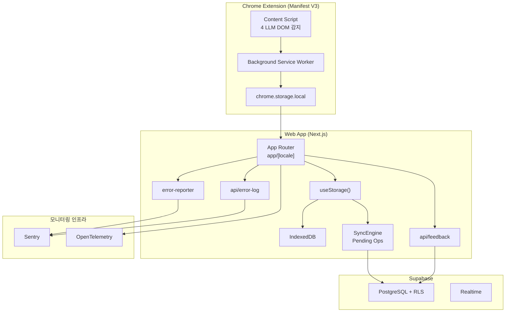
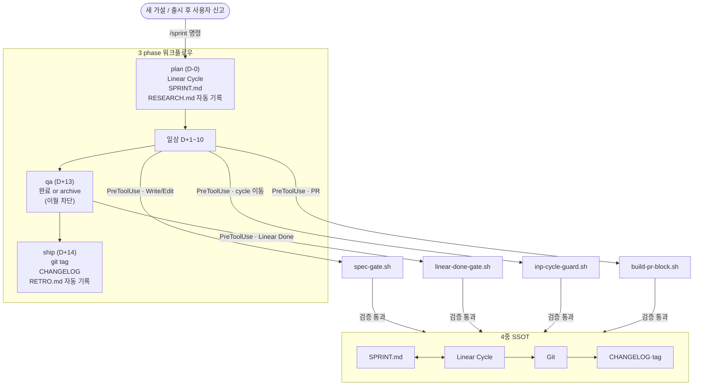
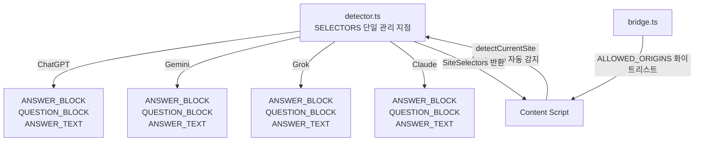
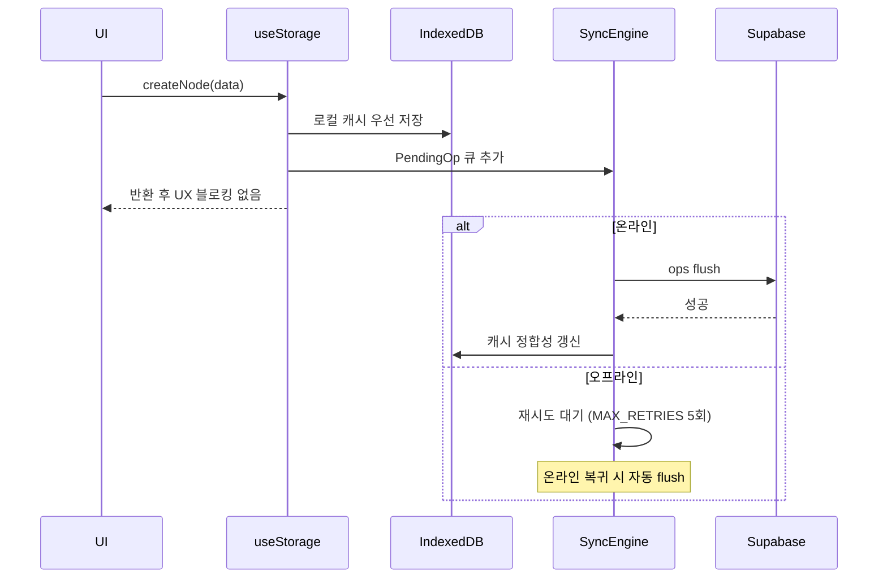
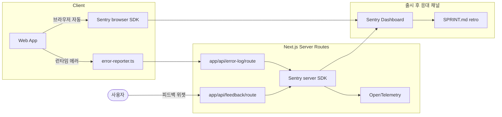

## [MindGraph] - AI 지식 캡처 & 그래프 시각화

ChatGPT·Gemini·Claude·Grok 4개 LLM 서비스의 답변을 hostname 자동 감지로 캡처해 의미 단위로 묶고 D3.js로 시각화하는 Chrome Extension·Next.js 웹앱입니다. 출시 후 사용자 피드백을 다음 sprint에 곧장 이어 붙일 수 있도록 사용자 피드백·에러 채널과 모니터링 인프라(PostHog·Sentry·OpenTelemetry·api/feedback·api/error-log)를 출시 전에 사전 구축한 1인 LLM 솔루션 프로토타입으로, 도메인 getmindgraph.com 등록 후 출시 전 단계이며 Claude Code 위에 9개 훅·plan·qa·ship 3 phase /sprint 워크플로우·4중 SSOT 자동 동기를 직접 설계했습니다 (Case 1에서 상세히 설명합니다).

### 전체적인 아키텍처

- **Architecture**: 사용자가 만나는 도구(Chrome Extension)와 통합 허브(Next.js 웹앱)를 분리하고, 사용자 신고·에러·피드백을 받을 라우트와 모니터링(Sentry·OpenTelemetry) 채널을 같은 코드 베이스에 사전 구축해 출시 후 1인 운영자가 응대와 솔루션 개선을 한 곳에서 처리할 수 있도록 설계했습니다.

### Case 1. 출시 후 1인 운영을 가능하게 할 AI 워크플로우 시스템 사전 설계

#### 1. 문제 원인

- 기획·구현·QA·출시 후 응대 전 구간을 한 사람이 책임지는 LLM 솔루션 프로토타입에서, AI와의 대화가 세션 간 초기화되어 같은 규칙·교정을 반복 설명하는 비용이 솔루션 안정화 시간을 갉아먹었습니다.
- AI가 사용자 확인 없이 commit·이슈 완료 같은 자율 행동을 해서 검증 안 된 변경이 main 브랜치에 그대로 머지되는 사고 위험이 컸습니다.
- 코드·이슈·문서·배포 기록 네 시스템이 같은 정보를 중복 관리하면, 출시 후 사용자 신고가 들어왔을 때 현재 상태 파악을 위해 네 곳을 수동 대조해야 하는 응대 지연이 발생한다고 판단했습니다.

#### 2. 해결 과정

- **9개 훅 자동 개입**: 도구 호출 시점에 자동 실행되는 9개 훅을 배치했고, 차단 게이트 4개(`spec-gate.sh`·`linear-done-gate.sh`·`build-pr-block.sh`·`inp-cycle-guard.sh`)와 보조 알림 5개(`stale-warn.sh`·`inp-reuse-suggest.sh`·`integrity-sync.sh`·`context-pack-stale.sh`·`worktree-env-symlink.sh`)로 분류했습니다.
- **/sprint 3 phase**: plan(Linear Cycle·SPRINT.md·RESEARCH.md 자동 기록)·qa(미완료 이슈 완료 또는 archive 강제, 이월 옵션 mechanism 차단)·ship(git tag·CHANGELOG·RETRO.md 자동 기록)을 단일 명령으로 연결하고 phase 진입 전 이전 산출물 존재 여부를 자동 검증했습니다. 옛 6단계(research/build/retro)는 plan의 RESEARCH.md 자동 기록과 ship의 RETRO.md 자동 기록으로 흡수했습니다.
- **4중 SSOT 동기**: SPRINT.md(문서)·Linear(이슈)·Git(코드)·CHANGELOG(배포 기록)에 역할을 하나씩 부여하고 `/sprint`가 단계마다 자동 동기화해, 출시 후 사용자 신고가 들어왔을 때 단일 진실 원천으로 현재 상태를 파악할 수 있는 동선을 사전 구축했습니다.
- **부서·에이전트 분리 + context-map 자동 라우팅**: 7개 부서(design·dev·docs·marketing·ops·product·qa)와 9개 에이전트(ceo·frontend/backend/qa-engineer·product-manager·ui-ux-designer·marketing-strategist·ops-engineer·knowledge-logger)별로 `department/{팀}/CLAUDE.md`와 `docs/` lifecycle 폴더를 분리하고, `RULES/context-map.md` + `SYSTEM/schemas/code-doc-mapping.yaml`로 task_type별 분류(new_feature·ui_change·api_change·bug_fix·refactor 등)과 코드 path glob(예: `storage/**` 변경 시 `DATABASE_SCHEMA.md`·`BACKEND.md`)을 must-read doc에 자동 매핑했습니다. CEO 에이전트가 워커에 위임할 때 합집합 5개 내외 doc만 prompt에 첨부되어, 출시 후 사용자 신고 응대 시 LLM 응답 정확도와 응대 속도를 사전 확보했습니다.

#### 3. 결과

- **성과**: 이슈 등록·SPRINT.md·CHANGELOG·Git 태그·Linear Done 같은 sprint 라이프사이클 반복 작업을 9개 훅·`/sprint` 3 phase로 자동화해, 출시 후 1인 운영자가 사용자 응대·솔루션 개선에 쓸 시간을 사전 확보할 수 있도록 했습니다.
- **배운 점**: 9개 훅·3 phase /sprint·4중 SSOT를 코드로 굳혀 두어, 새 작업마다 같은 규칙을 프롬프트로 다시 설명하지 않아도 sprint 라이프사이클이 자동으로 돌아가게 했습니다.

### Case 2. 외부 LLM 서비스 DOM 변경에 끌려다니지 않는 통합 레이어 설계

#### 1. 문제 원인

- 솔루션이 ChatGPT·Gemini·Grok·Claude 4개 외부 LLM 서비스에 의존하는 구조라, 출시 후 각 서비스 측 DOM이 사전 공지 없이 바뀌면 그대로 사용자가 만나는 솔루션 장애로 이어질 것이라 판단했습니다.
- 출시 후 사용자 신고 한 건이 들어오면 1인 운영자가 곧장 응대해야 하는데, DOM 변경 대응에 시간을 다 쓰면 다음 개선을 시작할 수 없는 구조였습니다.
- 초기에는 서비스별 선택자가 여러 파일에 분산되어 DOM 변경 한 건에 다수 파일 수정이 필요했습니다.

#### 2. 해결 과정

- **선택자 단일 지점**: 4개 LLM 서비스의 모든 DOM 선택자를 `detector.ts`의 `SELECTORS` 상수 객체로 모아, DOM 변경 시 이 상수만 수정하면 Content Script 전체에 일괄 적용되도록 했습니다.
- **hostname 자동 감지**: `window.location.hostname` 기반 `detectCurrentSite()` 함수가 페이지 식별과 올바른 선택자 반환을 자동 처리해, 사용자가 서비스를 수동 선택할 필요가 없습니다.
- **MV3 CSP 제약 준수**: `eval()` 사용 불가·외부 스크립트 동적 주입 불가 같은 Manifest V3 보안 정책 안에서 `chrome.runtime.sendMessage`를 통한 메시지 통신을 구현했습니다.
- **postMessage origin 화이트리스트**: 웹앱과 Extension 사이 인증 토큰 릴레이는 `bridge.ts`의 ALLOWED_ORIGINS 화이트리스트로 origin을 검증해 외부 페이지가 토큰을 가져갈 수 없게 차단했습니다(`SECURITY_POLICY.md §8`).

#### 3. 결과

- **성과**: 4개 LLM 서비스의 DOM 변경에 대응할 때 수정 범위를 `detector.ts` 상수 한 곳으로 한정해 출시 후 응대 시간을 사전 단축했고, origin 화이트리스트로 Extension과 Web 사이 인증 통합 보안을 함께 처리했습니다.
- **배운 점**: 4개 LLM 서비스 DOM 선택자를 detector.ts SELECTORS 한 곳에 모아 두니, DOM 변경 한 건 대응에 필요한 수정 파일 수가 한 개로 줄었습니다.

### Case 3. 현장 네트워크 단절 사용자를 위한 오프라인 우선 캐시 설계

#### 1. 문제 원인

- 사용자가 캡처를 가장 많이 시도할 곳이 카페·지하철·이동 중일 것이라 봤고, 출시 후 응대해야 할 환경 자체가 불안정한 네트워크일 가능성이 높다고 판단했습니다.
- 초기 구조가 Supabase 직접 쓰기였기 때문에 네트워크 단절 시 데이터가 사라지는 구조였고, 1인이 책임지는 LLM 솔루션 신뢰도가 출시 즉시 떨어질 수 있다고 봤습니다.
- Supabase RLS 정책 적용 중 오프라인 상태의 인증 토큰 만료 변수까지 함께 처리해야 해, IndexedDB 캐시·Pending Ops 큐·재시도 정책을 묶어 한 번에 풀어야 하는 사전 안정화 과제였습니다.

#### 2. 해결 과정

- **읽기 경로**: `useStorage()` 훅이 항상 IndexedDB 캐시에서 먼저 응답해 네트워크 상태와 무관하게 UI가 갱신되도록 했습니다.
- **쓰기 경로**: 로컬 캐시에 먼저 쓴 뒤 `syncToCloud()`가 `addPendingOps`로 큐에 기록하고 `flushPendingOps`를 await 없이 호출하는 Write-Behind 방식으로 설계해, 오프라인 상태에서도 사용자가 작업을 이어갈 수 있게 했습니다.
- **재시도 정책**: `sync-engine.ts`의 `MAX_RETRIES = 5` 상수로 실패한 op의 재시도 한도를 두어 재시도 비용 폭발을 차단했습니다.
- **Realtime 통합**: Supabase Realtime 채널 수신 시 `use-sync-manager`가 `refreshCache()`를 호출해 멀티 디바이스 변경을 캐시에 반영했습니다.

#### 3. 결과

- **성과**: 오프라인 상태에서 노드 CRUD가 동작하고 온라인 복귀 시 Pending Ops 큐가 자동 flush되어, "캡처가 사라진다" 시나리오를 출시 전에 차단해 출시 후 응대 대상에서 사전 제거했습니다.
- **배운 점**: IndexedDB 우선 쓰기·Pending Ops 큐(MAX_RETRIES=5)·Realtime refreshCache·재시도 정책 네 가지를 묶어, 오프라인 CRUD 후 온라인 복귀 시 큐가 자동 flush되게 했습니다.

### Case 4. 출시 후 사용자 에러·피드백 응대 인프라 사전 설계

#### 1. 문제 원인

- 1인 운영자가 출시 후 사용자 에러와 신고를 수동으로 받으면 응대 지연·누락이 발생할 것이고, 어떤 사용자가 어디서 막혔는지 시스템 안에서 추적할 방법이 없으면 응대 자체가 어렵다고 판단했습니다.
- 클라이언트 에러(JS 런타임 예외)는 사용자만 보고 서버 측에 도달하지 않으면 출시 후 운영자가 인지 자체를 못 하는 구조라, 인지 채널을 출시 전에 만들어 둬야 한다고 봤습니다.
- 사용자 피드백을 받을 채널을 출시 전에 만들어두지 않으면 출시 후 발생할 사용자 사고가 다음 sprint plan에 반영될 통로 없이 누락된다고 판단했습니다.

#### 2. 해결 과정

- **에러 리포터 클라이언트**: `lib/error-reporter.ts`가 클라이언트 런타임 예외를 감지해 `app/api/error-log/route.ts`로 전송하고, 같은 에러를 Sentry browser SDK가 별도로 직접 받는 이중 수집 채널을 사전 구축했습니다.
- **에러 로그 라우트**: `app/api/error-log/route.ts`가 클라이언트 측 에러를 서버에서 받아 Sentry server SDK에 위임해, 출시 후 운영자가 한 화면에서 확인할 수 있도록 동선을 설계했습니다.
- **피드백 라우트**: `app/api/feedback/route.ts`가 사용자 피드백 위젯에서 받을 입력을 Sentry feedback으로 연동해, 사용자 응대 채널과 에러 응대 채널을 한 곳에 묶어 출시 후 응대 인프라를 사전 구축했습니다.
- **OpenTelemetry 통합**: `instrumentation.ts`·`instrumentation-client.ts`에 OpenTelemetry SDK를 두고 OTLP exporter로 로그를 통합 수집해, 출시 후 시스템 흐름을 사용자 단위로 추적할 수 있는 채널을 사전 마련했습니다.
- **응대 결과 다시 sprint로**: Sentry에서 받을 사용자 사고를 `/sprint retro` 단계에서 다음 plan 입력으로 SPRINT.md에 기록할 동선을 사전 연결해, 출시 후 같은 문제가 반복되지 않도록 설계했습니다.

#### 3. 결과

- **성과**: 클라이언트 에러(error-reporter)·서버 에러(api/error-log)·사용자 피드백(api/feedback)·OpenTelemetry 로그 4개 채널을 Sentry 한 곳에 묶어, 출시 후 응대 대상이 단일 화면에 모이고 응대 결과를 다음 sprint plan으로 이어 붙일 수 있는 사이클을 사전 구축했습니다.
- **배운 점**: error-reporter·api/error-log·api/feedback·OpenTelemetry 네 채널을 Sentry 한 곳으로 모으고 retro 단계에서 SPRINT.md로 옮기는 동선을 코드로 연결한 결과, 사용자 사고가 다음 plan 입력으로 누락 없이 이어지는 흐름이 확보됐습니다.
