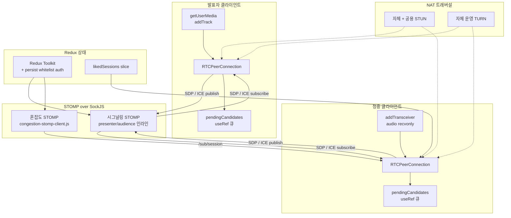
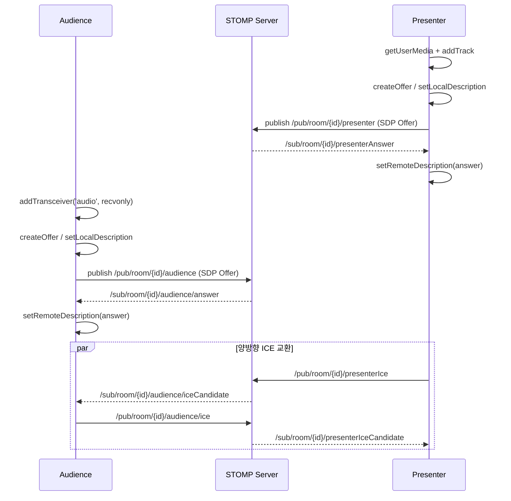
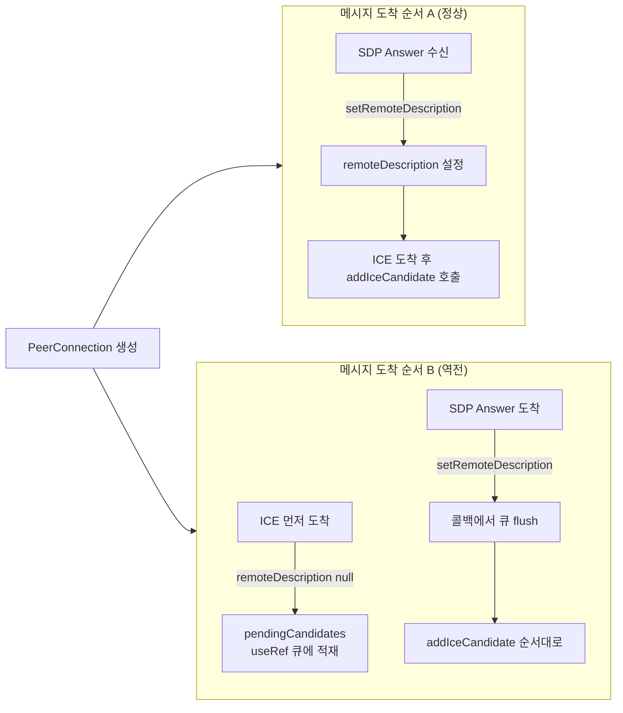
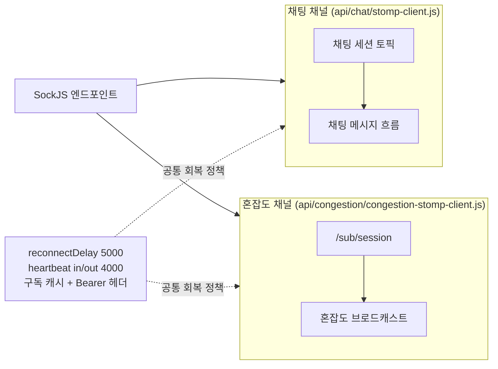

## [FiT] - WebRTC 시그널링을 직접 구현한 사일런트 컨퍼런스 플랫폼

행사장에서 다중 채널 발표를 무선 헤드폰으로 골라 듣는 사일런트 컨퍼런스의 온라인·오프라인 하이브리드 중계 플랫폼입니다. 본인은 FE 3명 중 한 명으로 참여해 RTCPeerConnection API 직접 사용·STOMP 클라이언트 설계·React useRef 기반 이벤트 큐잉을 담당했습니다.

### 전체적인 아키텍처

- **Architecture**: Vite + React 환경에서 RTCPeerConnection API를 라이브러리 래퍼 없이 직접 사용. 채팅 STOMP 클라이언트와 혼잡도 전용 STOMP 클라이언트를 이중화하고, React useRef 기반 ICE 큐로 비동기 메시지 순서 의존성을 클라이언트 상태 머신에서 직접 다뤘습니다.

### Case 1. STOMP 위 WebRTC 시그널링 직접 구현 (라이브러리 래퍼 없음)

#### 1. 문제 원인

- 사일런트 컨퍼런스 청취 경험은 발표자 입모양과 오디오 싱크가 어긋나면 무너지므로, HLS/RTMP 같은 수 초 단위 버퍼링 스택은 부적합하고 수백 밀리초 RTT를 확보하는 WebRTC가 필요했습니다.
- 사내 인프라에 별도 WebRTC SDK가 없어 시그널링 채널을 직접 정의해야 했고, 발표자·청중 양측 PeerConnection 라이프사이클을 React 컴포넌트 안에서 직접 관리해야 했습니다.

#### 2. 해결 과정

- **발표자 PeerConnection**: `getUserMedia`로 마이크 스트림을 받아 `addTrack`으로 PeerConnection에 부착하고, `createOffer`/`setLocalDescription`으로 만든 SDP를 STOMP `/pub/room/{id}/presenter` 토픽에 publish합니다.
- **청중 recvonly 트랜시버**: 음성 송출이 필요하지 않으므로 `pc.addTransceiver('audio', { direction: 'recvonly' })`로 수신 전용 트랜시버를 추가해 별도 PeerConnection을 만들어 SDP 협상 비용을 최소화했습니다.
- **ICE 후보 양방향 publish**: `onicecandidate` 콜백에서 생성되는 ICE 후보를 발표자/청중 각각 `/pub/room/{id}/presenterIce`·`/pub/room/{id}/audience/ice` 토픽으로 양방향 publish합니다.
- **NAT 트래버설**: 자체 운영 TURN 서버와 자체 STUN·공용 STUN을 `iceServers` 배열에 등록해 행사장 NAT 환경에서도 연결률을 확보했습니다.

#### 3. 결과

- **성과**: 발표자·청중이 동일한 STOMP 채널 위에서 SDP와 ICE를 교환하는 1:N 오디오 송수신 구성을 라이브러리 래퍼 없이 완성했습니다.
- **배운 점**: 라이브러리 래퍼 없이 createOffer·setLocalDescription·addIceCandidate를 직접 호출하면서 SDP·ICE 도착 순서를 컴포넌트 상태로 관리하는 흐름을 정리했습니다.

### Case 2. React useRef 기반 ICE 큐로 비동기 메시지 순서 의존성 처리

#### 1. 문제 원인

- 시그널링 초기 구현에서 SDP Answer가 도착하기 전에 ICE 후보가 먼저 도착하면 `setRemoteDescription`이 호출되지 않은 PeerConnection에 `addIceCandidate`를 시도하면서 예외가 발생했습니다.
- 후보 한 번 유실은 NAT 트래버설 실패로 이어져 미디어 트랙이 붙지 않는 무음 상태가 재현됐고, 실패 시 복구 경로가 없어 새로고침해야 했습니다.
- 원인은 STOMP `presenterAnswer`/`audience/answer`와 `presenterIceCandidate`/`audience/iceCandidate` 메시지의 도착 순서가 정렬되지 않는다는 점에 있었습니다.

#### 2. 해결 과정

- **useRef 큐**: 발표자·청중 컴포넌트 양쪽에 `pendingCandidates`라는 `useRef` 큐를 두고, ICE 메시지 수신 시 `pcRef.current.remoteDescription`이 비어 있으면 큐에 적재합니다.
- **flush 시점**: SDP Answer 수신 시점의 `setRemoteDescription` 콜백 안에서 큐에 쌓인 후보를 순서대로 `addIceCandidate`로 flush하고 큐를 비웁니다.
- **컴포넌트 ref 선택 이유**: PeerConnection이 컴포넌트 단위 라이프사이클을 가지기 때문에 useRef로 두었고, 전역 스토어에 두면 라우팅 전환·언마운트 시 잔여 후보가 다음 세션으로 누수될 위험이 있었습니다.

#### 3. 결과

- **성과**: SDP·ICE 도착 순서 역전으로 인한 초기 연결 실패가 사라지고 PeerConnection이 ICE Connected 상태에 도달하는 동작이 일관되었습니다.
- **배운 점**: pendingCandidates useRef 큐로 SDP Answer 도착 전 ICE 후보를 보관한 뒤 setRemoteDescription 직후 flush하도록 정렬해 ICE Connected 상태 도달이 일관됐습니다.

### Case 3. 채팅·혼잡도 채널의 STOMP 회복 정책과 채널 이중화

#### 1. 문제 원인

- 행사장 Wi-Fi·모바일 망이 일시적으로 끊기는 일이 잦았고 기본 STOMP 설정의 끊김 감지가 늦어 좀비 커넥션이 유지되며 수동 재연결이 필요해, 실시간 채팅과 혼잡도 표시가 새로고침 없이는 복구되지 않았습니다.
- 채팅 STOMP 하나에 혼잡도 토픽을 묶으면 채팅 메시지가 몰리는 구간에서 혼잡도 수신이 밀리거나 반대로 혼잡도 브로드캐스트가 채팅 채널을 점유할 위험이 있었습니다.

#### 2. 해결 과정

- **회복 정책 공통화**: 채팅(`api/chat/stomp-client.js`)·혼잡도(`api/congestion/congestion-stomp-client.js`) 두 STOMP 클라이언트에 `reconnectDelay: 5000`과 `heartbeatIncoming/Outgoing: 4000`을 동일하게 적용해 4초 간격 양방향 heartbeat로 좀비 커넥션을 감지하고 끊긴 뒤 5초 후 자동 재연결되도록 했습니다.
- **구독 캐시 + 권한 유지**: 새 세션에서 등록해 둔 토픽이 자동 복원되도록 구독 캐시를 두고, 인증 토큰을 `connectHeaders`와 각 `subscribe` 헤더에 모두 `Bearer` 형식으로 실어 백엔드 인터셉터 토큰 검증 흐름과 정합성을 맞췄습니다.
- **채널 이중화**: 혼잡도 전용 클라이언트를 채팅 클라이언트와 별도로 구성해 같은 SockJS 엔드포인트 위에 독립된 STOMP 세션을 띄우고 `/sub/session` 토픽 하나만 구독하도록 책임 범위를 좁혔습니다.
- **메시지 도메인 분리**: 혼잡도 데이터는 화면 갱신 콜백으로, 채팅 메시지는 채팅 렌더링 로직으로 책임을 분리했습니다.

#### 3. 결과

- **성과**: 망 단절 시 5초 안에 채팅·혼잡도 STOMP 세션이 자동 복구되고 구독·인증이 그대로 이어지며, 채팅과 혼잡도가 서로 다른 세션으로 흘러 한쪽 트래픽 폭증이 다른 쪽에 영향을 주지 않게 격리됐습니다.
- **배운 점**: 회복 정책은 공유하되 채널은 분리하는 패턴으로 두 트래픽의 운영 안정성을 동시에 확보했습니다.
