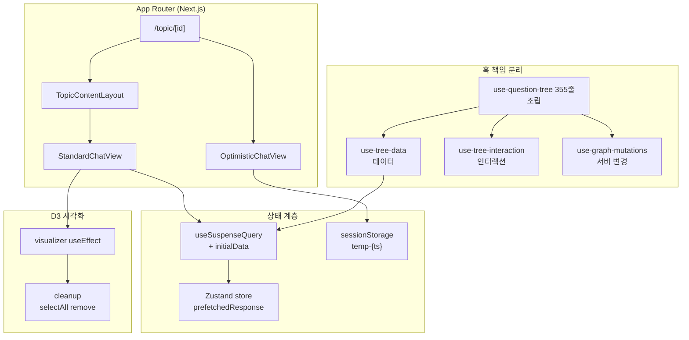
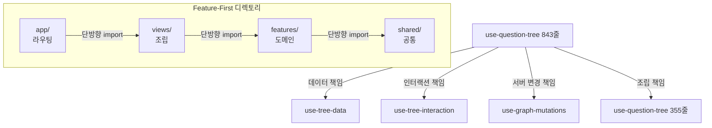
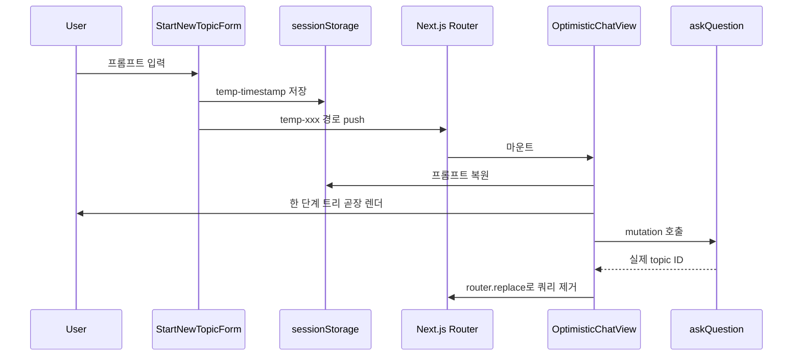
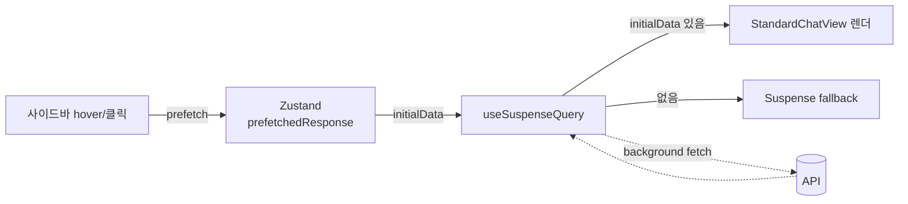
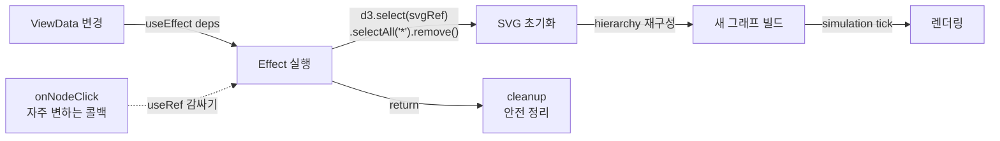

## [chatGraph] - AI 대화 시각화 플랫폼

기존 선형 채팅 UI에서 한 갈래 흐름만 살아남고 도중에 떠올린 분기 질문·맥락이 휘발되어 사용자가 이전 맥락을 다시 짜맞춰야 하는 비용이 컸습니다. chatGraph는 AI와의 대화를 꼬리물기 형태의 그래프로 시각화해 분기와 깊이를 보존하는 웹 서비스입니다. 본인은 4인 팀의 FE 한 명으로 참여해 React 라이프사이클 통합·Suspense 경계 설계·D3 cleanup 패턴을 담당했습니다.

### 전체적인 아키텍처

- **Architecture**: Feature-First 디렉토리(`app`·`features`·`views`·`shared`) 위에 훅 책임을 4개로 분리하고, 라우트별로 Suspense 경계와 Optimistic 경로를 나눠 D3 시각화를 React useEffect cleanup으로 안전하게 통합한 구조.

### Case 1. 거대 훅 책임 분리와 Feature-First 디렉토리 도입 (843줄에서 355줄로 축소)

#### 1. 문제 원인

- 트리 상태·인터랙션·서버 변경을 모두 끌어안은 `use-question-tree` 훅이 843줄까지 비대해져 변경 시 영향 범위 파악이 어려웠습니다.
- 페이지·기능·공통 코드 경계가 모호해 컴포넌트끼리 순환 import가 반복 발생했고, 새 기능 추가 시 어디에 코드를 두어야 하는지 팀 합의가 매번 필요했습니다.

#### 2. 해결 과정

- **4-책임 훅 분리**: 단일 훅이 들고 있던 책임을 트리 데이터(`use-tree-data`)·인터랙션 상태(`use-tree-interaction`)·서버 변경(`use-graph-mutations`)으로 분리하고 최상위에서 합성하는 형태로 정리했습니다.
- **단방향 import 정비**: `app`은 라우팅·`features`는 도메인·`views`는 조립·`shared`는 공통이라는 네 책임으로 디렉토리를 재정의하고 import 방향을 단방향으로 고정해 순환 참조를 차단했습니다.
- **점진적 리팩토링**: 본인 단독 커밋 3건에 걸친 누적 리팩토링으로 진행해 단일 거대 PR 위험을 분산했습니다.

#### 3. 결과

- **성과**: 핵심 훅을 843줄에서 355줄로, 인접 페이지 컴포넌트를 186줄에서 59줄로 축소하고 디렉토리 책임이 명확해져 팀 머지 충돌 빈도가 줄었습니다.
- **배운 점**: app·views·features·shared 단방향 import로 고정한 뒤 새 기능 추가 시 코드 위치 합의에 드는 시간이 줄고 머지 충돌 빈도가 감소했습니다.

### Case 2. Optimistic 라우팅으로 첫 입력과 첫 화면 사이 단절 제거

#### 1. 문제 원인

- 첫 질문 입력 시 LLM 응답이 도착할 때까지 화면이 멈춘 듯한 경험이 사용자 몰입을 끊었습니다.
- 토스트·스피너 방식은 생성될 URL을 미리 보여주지 못해 뒤로가기·새로고침·공유 동작이 어색했습니다.

#### 2. 해결 과정

- **임시 ID + sessionStorage**: `StartNewTopicForm`에서 `temp-{Date.now()}` 임시 ID를 만들어 sessionStorage에 프롬프트를 보관하고(`use-start-new-topic.ts`) 임시 경로로 push해 사용자 입력이 그려진 화면을 보여줍니다.
- **가짜 트리 렌더**: 이동한 경로에서 `useOptimisticTopicData` 훅이 sessionStorage 데이터를 복원해 한 단계짜리 트리를 렌더링하면서 동시에 실제 mutation을 실행합니다.
- **router.replace 정착**: mutation 성공 시 Zustand 스토어에 응답을 채우고 `router.replace`로 optimistic 쿼리 파라미터를 제거해 실제 topic ID 경로로 자연스럽게 전환합니다.

#### 3. 결과

- **성과**: 첫 입력과 첫 화면 사이의 단절을 없애 가장 큰 이탈 지점을 막았고, 새로고침·공유 링크도 정상 동작합니다.
- **배운 점**: 임시 ID 라우팅·sessionStorage 복원·mutation 성공 후 router.replace를 한 흐름으로 묶어 첫 입력 직후 빈 화면 노출 없이 채팅 화면이 그려졌습니다.

### Case 3. useSuspenseQuery initialData + Zustand 프리패치로 fallback 우회

#### 1. 문제 원인

- 사이드바에서 다른 토픽 클릭 시 useQuery가 새로 호출되며 페이지가 잠시 빈 상태로 보였고, App Router Suspense fallback이 노출되며 깜빡임이 발생했습니다.
- 데이터 양이 많은 토픽일수록 체감 지연이 커졌습니다.

#### 2. 해결 과정

- **사이드바 prefetch**: 사이드바에서 토픽 응답을 미리 받아 Zustand 스토어의 `prefetchedResponse` 슬롯에 저장합니다.
- **initialData 분기**: 페이지 진입 시 `useSuspenseQuery`의 initialData에 동일 topicId의 프리패치 응답이 있으면 그대로 사용(`use-topic-data.ts`)하고, 없을 때만 Suspense fallback을 거치도록 분기했습니다.
- **트리 변환**: `transformApiDataToViewData` 어댑터가 백엔드 응답을 트리 형태로 변환해 주입(`use-tree-data.ts`)합니다.
- **잔여 정리**: 사용한 프리패치 데이터는 effect cleanup에서 정리해 다음 토픽 전환 시 잔여 데이터가 섞이지 않도록 했습니다.

#### 3. 결과

- **성과**: 사이드바 기반 라우트 전환에서 빈 화면 노출 없이 트리가 그려지는 흐름을 확보했습니다.
- **배운 점**: 사이드바 prefetch를 Zustand prefetchedResponse에 적재하고 useSuspenseQuery의 initialData로 주입해 사이드바 토픽 전환 시 Suspense fallback 노출 케이스를 prefetch 미적재 경로로만 한정했습니다.

### Case 4. D3 + React useEffect cleanup 패턴으로 시각화 라이프사이클 안전화

#### 1. 문제 원인

- 팀원이 도입한 D3 Force Simulation은 SVG DOM을 직접 변형해서 React가 같은 SVG를 다시 그릴 때 잔여 노드·이벤트 리스너가 남아 시각적 결함이 발생했습니다.
- 토픽이 바뀌거나 트리가 갱신될 때마다 이전 시뮬레이션 상태가 새 데이터 위에 덧씌워졌습니다.

#### 2. 해결 과정

- **SVG 초기화 패턴**: visualizer 컴포넌트 useEffect에서 `d3.select(svgRef).selectAll("*").remove()`로 매 갱신마다 SVG 하위 트리를 초기화한 뒤 hierarchy·simulation을 다시 구성하는 패턴을 정리했습니다.
- **deps 최소화**: `onNodeClick` 같이 자주 변하는 콜백은 ref로 감싸 effect 의존성에서 분리하고, `currentPath` 등 시각적 강조에 영향을 주는 값만 deps에 포함해 불필요한 재구성을 막았습니다.
- **팀 역할 분담**: 색상 알고리즘·호버 desaturate는 팀원 코드 유지, 본인은 통합 지점인 라이프사이클·cleanup 흐름에 집중했습니다.

#### 3. 결과

- **성과**: 토픽이 바뀌거나 트리가 갱신될 때 SVG가 정상 재구성되어 잔여 노드·중복 이벤트 시각적 결함이 사라졌습니다.
- **배운 점**: visualizer useEffect의 cleanup에서 selectAll('*').remove()로 SVG를 초기화한 뒤 hierarchy를 재구성하도록 분리해 토픽 전환 시 잔여 노드·중복 이벤트가 사라졌습니다.
