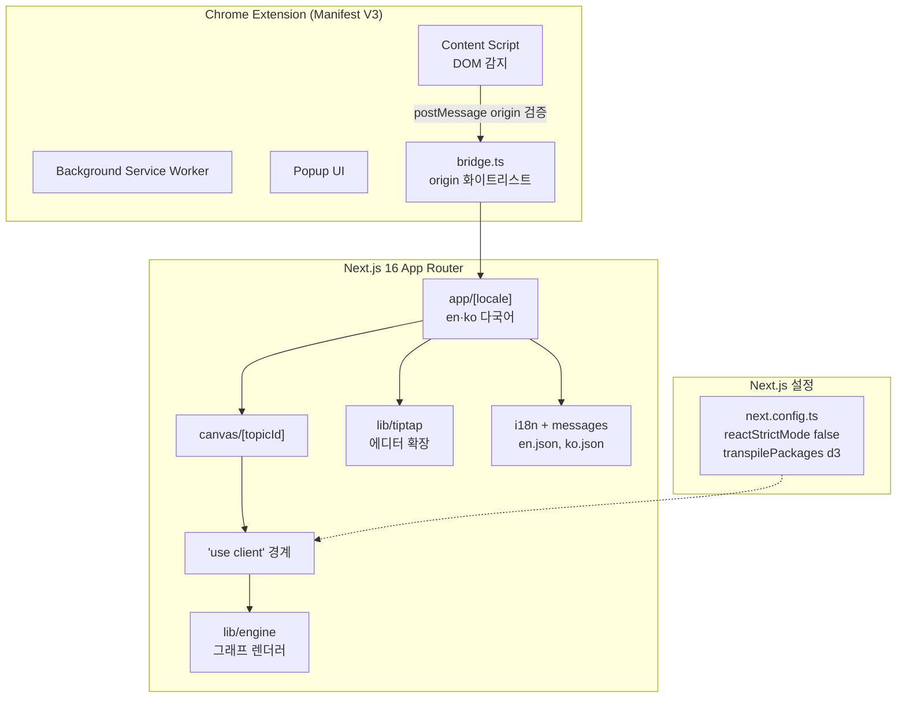
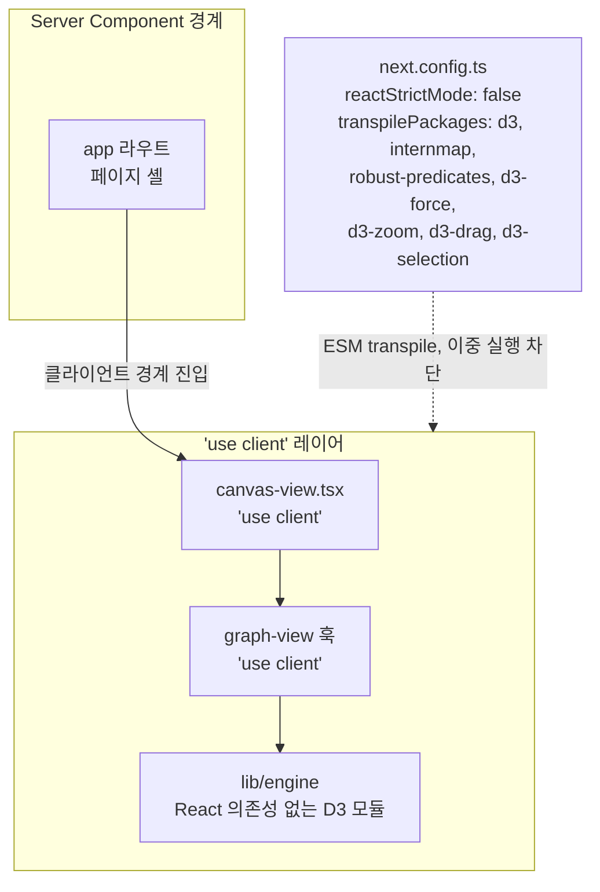
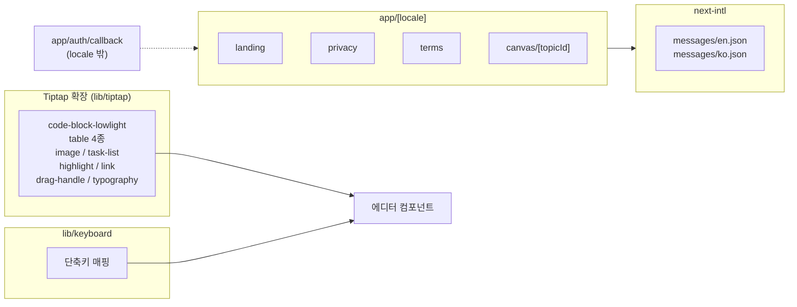
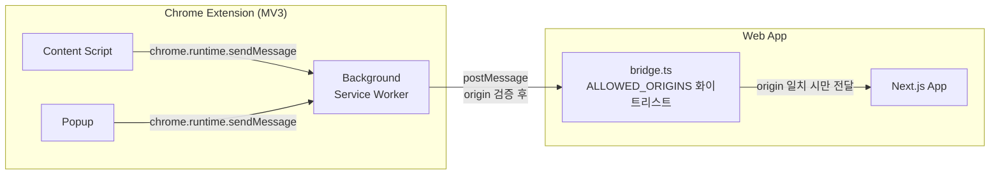

## [MindGraph] - AI 지식 캡처 & 그래프 시각화

ChatGPT·Gemini·Claude·Grok 4개 LLM 서비스의 답변을 캡처해 의미 단위로 묶고 D3.js로 시각화하는 Chrome Extension·Next.js 웹앱입니다. React 19·Next.js 16 App Router·D3·Tiptap·next-intl 다국어 라우팅을 한 코드 베이스에서 다루며, Vite 3종(Service Worker·Content Script·Bridge) 빌드 설정과 Next.js transpilePackages·StrictMode 정책 같은 빌드·번들 결정으로 Manifest V3 Extension과 Web 사이 메시지 통신·origin 검증까지 한 시스템 안에 두었습니다.

### 전체적인 아키텍처

- **Architecture**: Server Component 경계와 `'use client'` 레이어를 분리해 D3 같은 명령형 DOM 라이브러리를 한쪽에 격리하고, `[locale]` 라우팅 + en/ko 메시지로 다국어를 코드 베이스 안에서 다루며, Tiptap 에디터를 `lib/tiptap` 모듈에 모아 확장 관리합니다.

### Case 1. D3.js DOM 조작과 Next.js SSR 충돌을 분리한 클라이언트 전용 그래프 엔진 격리

#### 1. 문제 원인

- D3.js는 ESM 패키지이며 서버 환경에서 임포트하면 빌드 실패나 SSR 단계 DOM API 접근 오류가 발생했습니다.
- Next.js `reactStrictMode`가 켜진 dev 모드에서 `useEffect`가 두 번 실행되면서 D3 zoom이 같은 SVG에 이중 바인딩되어 휠 한 번에 두 단계가 줌되는 결함이 있었습니다.
- 그래프 엔진을 일반 모듈로 두면 Server Component에서 임포트하는 경로가 생겨 빌드 시점에 잡히지 않는 사고가 가능했습니다.

#### 2. 해결 과정

- **엔진 모듈 격리**: `lib/engine` 그래프 렌더러를 React 의존성 없는 순수 D3 모듈로 분리하고, `'use client'` 선언된 `canvas-view.tsx`와 `use-tree-sync` 같은 훅에서만 호출되도록 호출 경계를 단방향으로 고정했습니다.
- **reactStrictMode 비활성화**: `next.config.ts`의 `reactStrictMode: false`로 dev 모드 이중 실행을 차단해 D3 zoom 이중 바인딩을 막았고, 의도(`StrictMode 비활성화: D3 렌더러 이중 실행 방지`)를 주석에 함께 기록했습니다.
- **D3 ESM transpile**: `transpilePackages: ['d3', 'internmap', 'robust-predicates', 'd3-force', 'd3-zoom', 'd3-drag', 'd3-selection']`를 설정해 D3 계열 ESM 패키지가 서버 빌드 경로에 들어와도 Next.js가 transpile하도록 했습니다.

#### 3. 결과

- **성과**: D3 zoom 이중 바인딩이 사라져 휠 한 번에 한 단계만 줌되도록 정상화했고, 그래프 엔진이 Server Component에 잘못 임포트되어도 영향 범위가 클라이언트 경계 안으로 한정되었습니다.
- **배운 점**: D3처럼 DOM에 직접 접근하는 라이브러리를 Next.js App Router에서 다룰 때 `'use client'` 선언 위치·ESM transpile 설정·StrictMode 정책 세 가지를 함께 맞춰, zoom 이중 바인딩 없이 렌더링되도록 했습니다.

### Case 2. Tiptap 에디터 확장 모듈화와 next-intl 다국어 라우팅 단일화

#### 1. 문제 원인

- 노드 본문 편집에 일반 contenteditable은 IME·붙여넣기·키보드 단축 처리가 약했고, Tiptap 기본 확장만으로는 LLM 답변에 자주 등장하는 코드 블록·표·이미지·체크리스트를 모두 다룰 수 없었습니다.
- 확장과 단축키가 컴포넌트 안에 분산되면 새 확장 추가나 통합 단축 정책 변경 비용이 누적됐습니다.
- 한국어·영어 양쪽 사용자를 받기 위해 메타데이터·랜딩·약관·인증 화면을 다국어로 제공해야 했고, 메시지를 컴포넌트에 하드코딩하면 번역 검수 시 코드 베이스 전체를 뒤져야 했습니다.

#### 2. 해결 과정

- **Tiptap 확장 모듈화**: `lib/tiptap`에 `code-block-lowlight`·`table` 4종·`image`·`task-list`·`highlight`·`link`·`drag-handle`·`typography` 확장을 모아 두고 에디터 컴포넌트에서 import해 사용했습니다.
- **단축키 분리**: `lib/keyboard`에 단축키 매핑을 모아 에디터·캔버스·검색이 같은 단축 정책을 공유하도록 했습니다.
- **next-intl 라우트 그룹**: `app/[locale]` 동적 세그먼트 아래 `landing`·`privacy`·`terms`·`canvas/[topicId]`를 두어 모든 사용자 화면이 locale을 거치고 메시지는 `messages/{en,ko}.json` 두 JSON에서 끝나도록 했습니다.
- **OAuth 콜백 분리**: 콜백은 `app/auth/callback`을 별도 둬 locale 변경 영향을 받지 않게 해 provider 등록 URL을 ko/en별로 따로 관리하지 않도록 했습니다.

#### 3. 결과

- **성과**: 새 Tiptap 확장 추가가 `lib/tiptap`에 의존성 등록 한 단계로 끝나고, 번역 검수는 두 JSON 파일에서 마무리되며, OAuth 콜백은 다국어 라우트와 독립적으로 동작합니다.
- **배운 점**: 확장·단축키·메시지·인증 콜백 네 가지를 각각의 단일 진입점으로 모아 새 기능 추가 시 손대야 할 파일을 한 곳으로 좁혔습니다.

### Case 3. Manifest V3 Extension과 Web 사이 메시지 통신·origin 검증

#### 1. 문제 원인

- Chrome Extension MV3에서 Web 도메인으로 인증 토큰을 넘기는 표준 경로가 없어, postMessage 기반 자체 브리지를 만들어야 했습니다.
- postMessage는 origin을 명시 검증하지 않으면 외부 페이지가 임의로 토큰을 가져갈 수 있는 보안 결함이 생깁니다.
- MV3는 `eval()` 금지·외부 스크립트 동적 주입 금지 같은 CSP 제약이 있어 일반 웹앱 통신 패턴을 그대로 쓸 수 없습니다.

#### 2. 해결 과정

- **bridge.ts 화이트리스트**: 웹앱 쪽 `bridge.ts`가 `ALLOWED_ORIGINS` 상수에 허용 origin 목록을 두고, postMessage 수신 시 `event.origin`이 화이트리스트에 있을 때만 처리합니다(`SECURITY_POLICY.md §8` 강제).
- **chrome.runtime.sendMessage**: Extension 내부 통신은 `eval` 없이 안전한 `chrome.runtime.sendMessage` 채널만 사용합니다.
- **3-vite 빌드 분리**: `vite.config.extension.ts`·`vite.config.content.ts`·`vite.config.bridge.ts` 3개 vite 설정으로 Service Worker·Content Script·인증 bridge 번들 요구사항을 분리해 각 환경 보안 제약을 따로 다룹니다.
- **인증 토큰 한 방향**: Extension에서 Web 방향으로만 토큰이 흐르고 역방향은 없게 해 토큰 노출 표면을 최소화했습니다.

#### 3. 결과

- **성과**: 외부 페이지가 임의로 mindgraph 인증 토큰을 가져가는 경로를 origin 화이트리스트로 차단했고, MV3 CSP 제약 안에서 Extension과 Web 사이 메시지 통신을 한 방향 흐름으로 정리했습니다.
- **배운 점**: ALLOWED_ORIGINS 화이트리스트를 bridge.ts에 두고 Service Worker·Content Script·bridge 번들을 3개 vite 설정으로 분리해, MV3 CSP 위반 없이 인증 토큰이 화이트리스트 origin으로만 전달되도록 했습니다.
