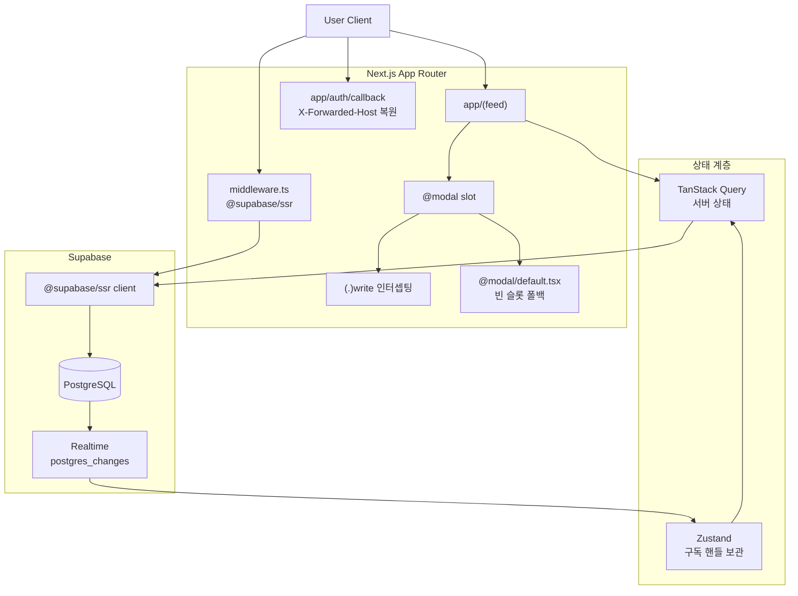
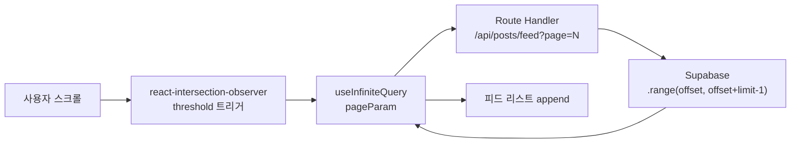
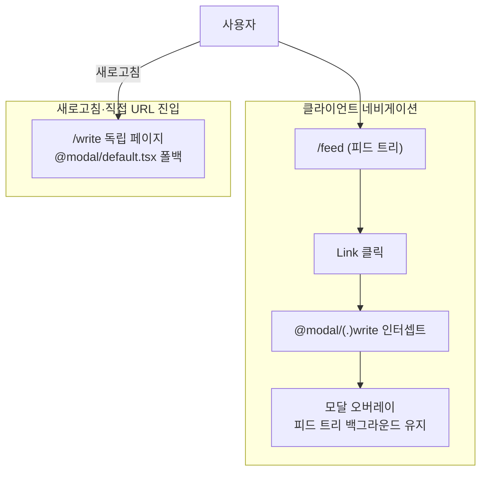
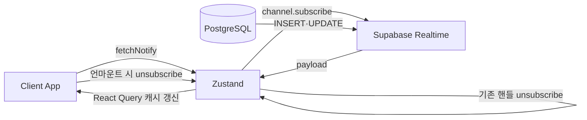

## [xAB] - 실시간 투표 및 소통 중심의 A/B 테스트 SNS

두 선택지에 대한 실시간 투표·댓글 토론을 반영하는 SNS로, 본인은 4인 FE 팀에 참여해 Next.js App Router 병렬·인터셉팅 라우트 모달·useInfiniteQuery 무한 스크롤·Supabase Realtime 구독 수명 관리·@supabase/ssr 미들웨어·OAuth 콜백 X-Forwarded-Host 복원을 담당했습니다.

### 전체적인 아키텍처

- **Architecture**: 병렬 라우트(`@modal`) + 인터셉팅 라우트(`(.)write`)로 모달·독립 페이지를 같은 URL로 처리하고, `@supabase/ssr` 미들웨어가 매 요청에서 세션을 검증하며, Realtime 구독 핸들을 Zustand에 보관해 라이프사이클을 통제합니다.

### Case 1. useInfiniteQuery + Intersection Observer 무한 스크롤

#### 1. 문제 원인

- 메인 피드 접속 시 게시글·투표 옵션·댓글 수·좋아요 정보를 한 번에 불러오는 구조에서 첫 화면 진입 응답 페이로드와 렌더링 비용이 누적되었습니다.
- 뷰포트 밖 게시글까지 동일 비중으로 페칭·렌더링하면 초기 화면 그려지기까지의 체감 지연이 발생했습니다.

#### 2. 해결 과정

- **useInfiniteQuery 페이지네이션**: TanStack Query의 `useInfiniteQuery`로 페이지네이션 상태를 관리하고 `pageParam`을 다음 페이지 요청에 전달.
- **Intersection Observer 트리거**: `react-intersection-observer`로 뷰포트 하단 트리거 요소 노출 시점을 감지해 다음 페이지를 fetch.
- **Supabase range**: Route Handler가 `page` 쿼리 파라미터를 받아 `.range(offset, offset + limit - 1)`로 페이지 단위 응답만 반환하도록 서버·클라이언트 분할 단위를 일치.

#### 3. 결과

- **성과**: 초기 진입 데이터가 줄어 첫 화면 체감 지연이 완화되고, 스크롤 위치에 따라 점진적으로 데이터가 채워지는 무한 스크롤을 구현했습니다.
- **배운 점**: useInfiniteQuery + Intersection Observer + Supabase .range()를 일치시켜 초기 응답 페이로드를 페이지 단위로 줄였고 스크롤에 따라 점진적으로 채워졌습니다.

### Case 2. 병렬 라우트 슬롯(@modal) + 인터셉팅 라우트((.)write)로 모달·독립 페이지를 같은 URL로

#### 1. 문제 원인

- 피드에서 게시글 작성·상세 화면으로 이동할 때 전체 페이지가 다시 렌더되며 스크롤 위치·인터랙션이 초기화되었습니다.
- 기존 라우팅은 페이지 컨텍스트를 완전히 교체해 이전 화면 상태를 유지한 채 상호작용할 수 없는 한계가 있었습니다.

#### 2. 해결 과정

- **병렬 라우트 슬롯**: `app/@modal` 슬롯과 메인 라우트를 병렬 배치해 두 트리를 동시에 렌더링할 수 있는 구조를 만들었습니다.
- **인터셉팅 라우트**: `@modal/(.)write` 인터셉팅으로 클라이언트 네비게이션 시 모달 오버레이가 렌더, 직접 URL 진입·새로고침 시 독립 페이지가 렌더되도록 분기.
- **빈 슬롯 폴백**: `@modal/default.tsx`에 빈 슬롯 폴백을 두어 슬롯이 활성화되지 않은 라우트에서도 트리가 흐트러지지 않게 동작.

#### 3. 결과

- **성과**: 게시글 작성·상세 진입 시 피드 위치·스크롤 컨텍스트가 보존되어 탐색이 끊기지 않고, 모달·독립 페이지 진입을 같은 URL로 처리해 공유 링크·새로고침 시에도 일관된 화면을 갖췄습니다.
- **배운 점**: @modal 슬롯 + (.)write 인터셉팅을 결합해 클라이언트 네비게이션은 모달 오버레이, 새로고침·직접 URL 진입은 독립 페이지로 분기되도록 같은 URL에서 두 진입 방식을 처리했습니다.

### Case 3. Supabase Realtime postgres_changes + Zustand 구독 핸들 수명 관리

#### 1. 문제 원인

- SNS 특성상 댓글·투표가 빈번하게 발생하지만 사용자가 새로고침을 누르기 전까지 최신 데이터를 확인할 수 없는 정적 환경이 소통을 저해했습니다.
- 주기적 폴링은 변화 없을 때도 호출이 반복되어 서버 부하·네트워크 비용을 누적.
- 구독 핸들을 관리하지 않으면 컴포넌트 마운트·언마운트·사용자 전환 시 중복 구독으로 인한 리소스 누수가 발생.

#### 2. 해결 과정

- **postgres_changes 구독**: Supabase Realtime의 `postgres_changes` 이벤트로 DB 변경 사항을 WebSocket으로 수신.
- **TanStack Query 캐시 갱신**: 댓글 영역에서 새 댓글 도착 시 React Query 캐시를 갱신해 화면이 자동 반영되도록 연동.
- **구독 핸들 보관**: 알림 영역에서 Zustand 스토어가 구독 해제 핸들을 함께 보관해 재진입·사용자 전환 시 이전 구독을 정리한 뒤 재구독, 중복 구독 누수 방지.

#### 3. 결과

- **성과**: 새로고침 없이 새 댓글·알림이 반영되는 라이브 환경을 갖췄고, 폴링 제거로 불필요한 요청을 줄였습니다.
- **배운 점**: Zustand 스토어에 postgres_changes 구독 해제 핸들을 함께 보관해 재진입·사용자 전환 시 이전 구독을 정리한 뒤 재구독하도록 만들어 중복 구독 누수가 사라졌습니다.

### Case 4. @supabase/ssr 미들웨어 인증 + OAuth 콜백 X-Forwarded-Host 오리진 복원

#### 1. 문제 원인

- 인증되지 않은 사용자의 보호 경로 접근을 차단하려면 서버 측 세션 검증이 필요했고, 클라이언트 단독 검증은 보호 라우트 fallback이 깜빡이는 결함이 있었습니다.
- 로드밸런서·리버스 프록시 환경에서 OAuth 콜백 URL을 만들 때 `request.url`의 host가 내부 호스트로 보여 잘못된 도메인으로 리다이렉트되는 사고가 발생할 수 있었습니다.
- 미들웨어 인증·OAuth 콜백 두 흐름이 분리되어 있으면 인증 사고가 어느 경로에서 발생했는지 추적이 어려웠습니다.

#### 2. 해결 과정

두 흐름을 한 시스템 안에 함께 두었습니다.

- **인증 흐름**: 사용자 요청을 받은 `middleware.ts`가 `getUser`로 세션을 검증해 보호 라우트면 인증 분기, 미인증이면 로그인 리다이렉트로 보냅니다
- **OAuth 콜백 흐름**: OAuth provider 콜백이 `app/auth/callback`에 도착하면 X-Forwarded-Host 헤더로 원본 오리진을 복원해 올바른 도메인으로 리다이렉트합니다

- **@supabase/ssr 미들웨어**: `middleware.ts`에서 `@supabase/ssr` 기반으로 매 요청마다 서버 측 세션을 검증하고 미인증 사용자를 로그인 페이지로 리다이렉트.
- **getUser() 호출**: 미들웨어가 `supabase.auth.getUser()`로 토큰 유효성을 매 요청 검증해 만료 토큰 사용을 차단.
- **X-Forwarded-Host 우선 참조**: OAuth 콜백 라우트(`app/auth/callback`)에서 `request.headers.get('x-forwarded-host')`를 우선 참조해 원본 오리진을 복원, 로드밸런서 환경에서도 올바른 도메인으로 리다이렉트.
- **콜백 라우트 분리**: 콜백 라우트는 `[locale]`에 종속시키지 않아 OAuth provider 측 등록 리다이렉트 URL 관리 비용을 줄였습니다.

#### 3. 결과

- **성과**: 미인증 사용자 보호 경로 접근이 서버 단계에서 차단되어 클라이언트 fallback 깜빡임이 사라지고, 로드밸런서 환경에서도 OAuth 콜백이 원본 도메인으로 정확히 돌아옵니다.
- **배운 점**: middleware.ts의 getUser()로 매 요청 세션을 검증하고 OAuth 콜백에서 x-forwarded-host를 우선 참조하도록 두어 보호 라우트 fallback 깜빡임과 로드밸런서 환경의 잘못된 리다이렉트가 함께 사라졌습니다.
