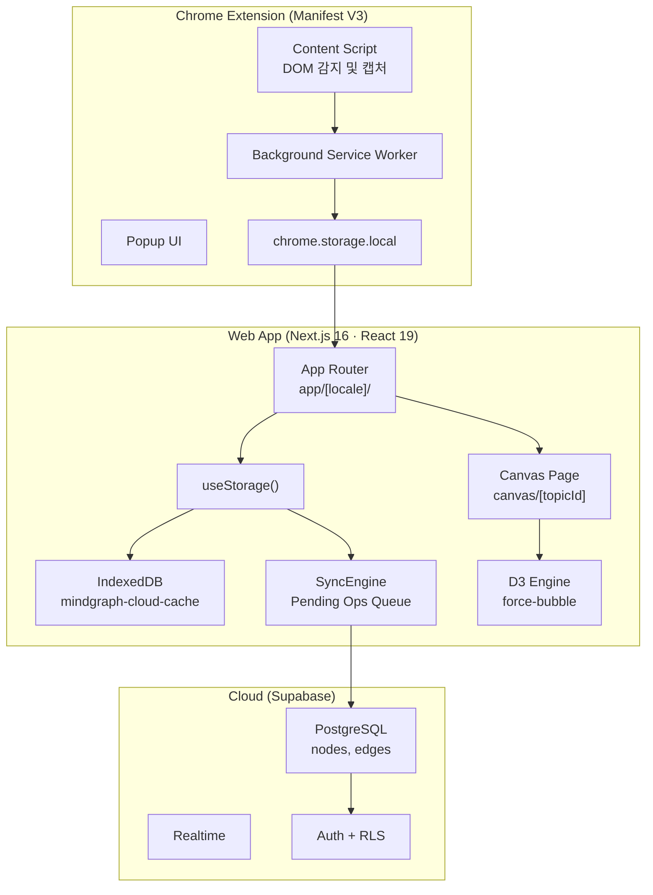
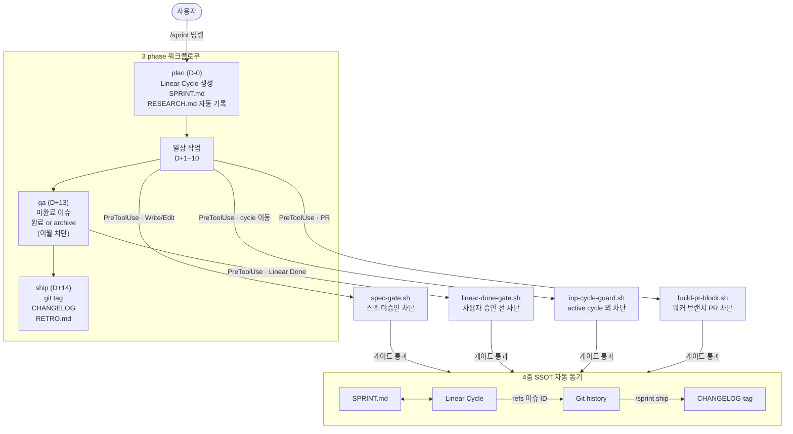
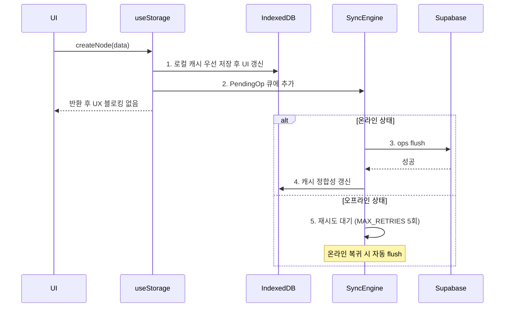
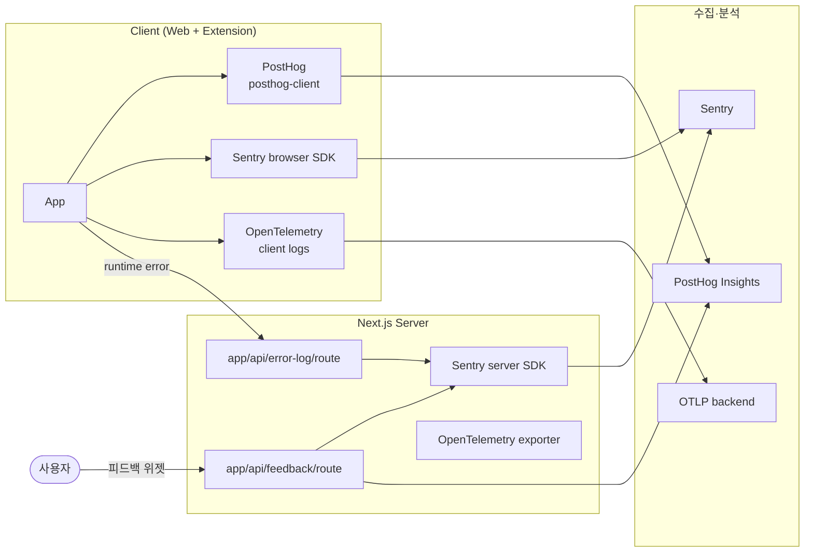
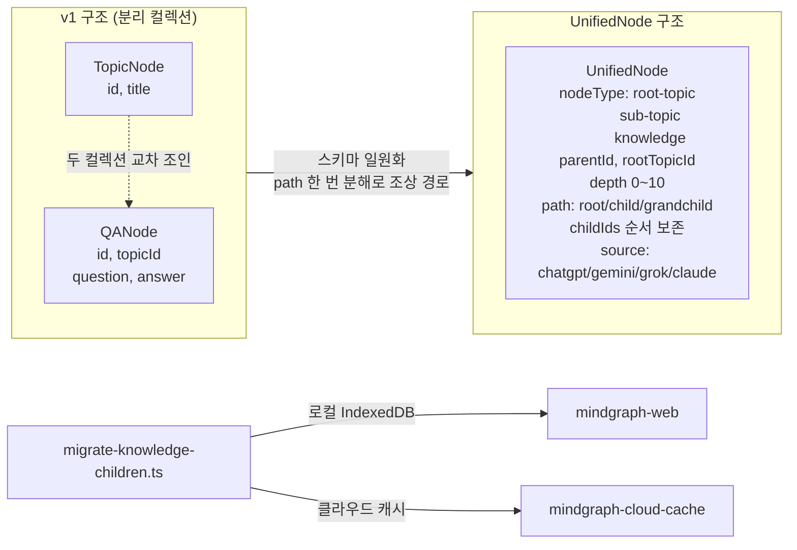

## [MindGraph] - AI 지식 캡처 & 그래프 시각화

ChatGPT·Gemini·Claude·Grok 4개 LLM 서비스의 답변을 캡처해 의미 단위로 묶고 D3.js로 시각화하는 Chrome Extension·Next.js 웹앱입니다. "여러 LLM 서비스에 흩어진 답변을 한 곳에 모으면 사용자의 사고 흐름이 보존된다"는 가설을 코드보다 문제 정의에서 먼저 잡고, 1인 PO가 Chrome Extension·Next.js 웹앱·Supabase 백엔드를 풀스택으로 책임지며 도메인 getmindgraph.com 출시 대비 1인 프로토타입 빌드를 주도적 오너십으로 진행하고 있습니다. 가설을 빠르게 검증하기 위해 Claude Code 위에 9개 훅·plan·qa·ship 3 phase /sprint 워크플로우·4중 SSOT 자동 동기를 직접 설계했습니다 (Case 1에서 상세히 설명합니다).

### 전체적인 아키텍처

- **Architecture**: Chrome Extension(MV3)이 캡처 전용 도구, Next.js 16 App Router 웹앱이 지식 정리·그래프 편집·검색·동기화 허브. Extension 빌드는 `vite.config.extension.ts`·`vite.config.content.ts`·`vite.config.bridge.ts` 3개 vite 설정으로 Service Worker·Content Script·인증 bridge 번들을 분리했습니다.

### Case 1. 1인 PO 환경에서 AI를 팀처럼 운영하는 워크플로우 시스템 설계

#### 1. 문제 원인

- 1인 PO가 기획·구현·QA·배포를 혼자 담당하면서 AI와의 대화가 세션 간 초기화되어 같은 규칙·교정을 반복 설명하는 비용이 다음 가설 검증 시간을 갉아먹었습니다.
- AI가 사용자 확인 없이 commit 생성·이슈 완료 처리 같은 자율 행동을 해서 검증 안 된 변경이 그대로 main 브랜치에 머지되는 사고 위험이 있었습니다.
- 코드·이슈·문서·배포 기록 네 시스템이 같은 정보를 중복 관리해 현재 상태 파악을 위해 네 곳을 수동 대조해야 했습니다.

#### 2. 해결 과정

- **9개 훅 자동 개입**: 도구 호출 시점에 자동 실행되는 9개 훅을 두어 차단 게이트 4개(`spec-gate.sh`, `linear-done-gate.sh`, `build-pr-block.sh`, `inp-cycle-guard.sh`)와 보조 알림 5개(`stale-warn.sh`, `inp-reuse-suggest.sh`, `integrity-sync.sh`, `context-pack-stale.sh`, `worktree-env-symlink.sh`)로 분류했습니다.
- **/sprint 메타 스킬 3 phase**: plan(Linear Cycle 생성·SPRINT.md 작성·직전 cycle RESEARCH.md 자동 기록)·qa(미완료 이슈를 완료 또는 archive로 강제 결정, 이월 옵션 mechanism 차단)·ship(git tag·CHANGELOG·RETRO.md 자동 기록)을 하나의 명령으로 연결하고, 각 phase 진입 전 이전 phase 산출물 존재 여부를 자동 검증했습니다. 옛 6단계(research/build/retro)는 plan의 RESEARCH.md 자동 기록과 ship의 RETRO.md 자동 기록으로 흡수했습니다.
- **4중 SSOT**: SPRINT.md(문서)·Linear Cycle(이슈)·Git(코드)·CHANGELOG(배포 기록)에 역할을 하나씩만 부여하고 `/sprint`가 단계마다 자동 동기화했습니다.
- **5층 컨텍스트 영속화**: Conversation·Memory·CLAUDE.md·Hook·Skill 5층에 규칙을 분산해 교정이 바로 반영되고 다음 세션에 자동 로드되며 매 세션 system prompt에 강제되고 도구 호출 시 차단됩니다.
- **부서·에이전트 분리 + context-map 자동 라우팅**: 7개 부서(design·dev·docs·marketing·ops·product·qa)와 9개 에이전트(ceo·frontend/backend/qa-engineer·product-manager·ui-ux-designer·marketing-strategist·ops-engineer·knowledge-logger)별로 `department/{팀}/CLAUDE.md`와 `docs/` lifecycle 폴더를 분리하고, `RULES/context-map.md` + `SYSTEM/schemas/code-doc-mapping.yaml`로 task_type별 분류(new_feature·ui_change·api_change·bug_fix·refactor 등)과 코드 path glob을 must-read doc에 매핑했습니다. CEO 에이전트가 워커에 위임할 때 합집합 5개 내외 doc만 prompt에 첨부되어 매 세션 LLM이 받는 컨텍스트 표면이 좁혀졌고, PO가 가설을 코드로 옮길 때 LLM 응답 정확도와 토큰 비용을 동시에 잡았습니다.

#### 3. 결과

- **성과**: 이슈 등록·SPRINT.md 작성·CHANGELOG 갱신·Git 태그·Linear Done 전환 같은 sprint 라이프사이클 반복 작업을 9개 훅·`/sprint` 3 phase로 자동화해 PO가 가설 검증에 시간을 다시 쓸 수 있게 했습니다.
- **배운 점**: 9개 훅과 3 phase /sprint, 4중 SSOT 자동 동기를 코드화한 결과 가설 검증에 쓰는 시간 비중이 다시 늘었습니다.

### Case 2. 끊김 없는 캡처 UX를 위한 Write-Behind 캐시 설계

#### 1. 문제 원인

- 캡처는 카페·지하철 같은 이동 중에 가장 자주 일어나리라 가정했는데 초기 구조가 Supabase 직접 쓰기여서 네트워크 단절 시 사용자 입력이 사라질 수 있는 구조였고, PO 입장에서 가장 큰 사용자 이탈 요인이 될 것이라 판단했습니다.
- 온라인 복귀 후 누락 노드를 수동 재입력해야 하면 새 캡처 흐름의 신뢰도가 떨어져 출시 후 다음 가설 검증을 시작하지 못한다는 리스크가 있다고 봤습니다.

#### 2. 해결 과정

- **읽기 경로**: `useStorage()` 훅이 항상 IndexedDB 캐시에서 먼저 응답해 네트워크와 무관하게 UI가 갱신되도록 했습니다.
- **쓰기 경로**: 로컬 캐시에 먼저 쓴 뒤 `syncToCloud()`가 `addPendingOps`로 큐에 기록하고 `flushPendingOps`를 await 없이 호출하는 Write-Behind 방식을 적용했습니다.
- **재시도 정책**: `sync-engine.ts`의 `MAX_RETRIES = 5` 상수로 실패한 op의 재시도 한도를 두고, 초과 시 `status: 'failed'`로 마킹해 재시도 비용 폭발을 차단했습니다.
- **Realtime 통합**: Supabase Realtime 채널 수신 시 `use-sync-manager`가 `refreshCache()`를 호출해 멀티 디바이스 동기화를 처리했습니다.
- **캐시 분리**: 클라우드 캐시(`mindgraph-cloud-cache`)와 로컬 데이터(`mindgraph-web`)를 별도 IndexedDB로 두어 로그아웃 시 클라우드만 비우고 비로그인 로컬 데이터는 유지했습니다.

#### 3. 결과

- **성과**: 오프라인 상태에서 노드 CRUD가 동작하고 온라인 복귀 시 Pending Ops 큐가 자동 flush되며 멀티 디바이스 동기화 구조를 확보했습니다.
- **배운 점**: "끊김 없는 캡처"라는 PO 약속을 IndexedDB 분리·pending 큐·Realtime 통합·재시도 정책을 묶은 시스템으로 풀어, 오프라인에서도 캡처가 유실되지 않게 했습니다.

### Case 3. 관측성·피드백 인프라 사전 구축으로 출시 후 가설 검증 사이클 짧게 닫는 설계

#### 1. 문제 원인

- 1인 PO 환경에서 출시 후 사용자가 어디서 막힐지 받을 데이터 채널이 없으면 다음 가설 결정 근거가 부재할 것이라 판단했습니다.
- 사용자 에러·요청을 받을 통로를 출시 전에 만들어두지 않으면 출시 후 발생할 사용자 사고가 다음 sprint plan에 반영될 통로 없이 누락된다고 판단했습니다.
- 클라이언트 에러와 서버 에러, 사용자 행동 이벤트가 분리된 시스템에 흩어져 있으면 출시 후 동일 사용자의 흐름을 한 줄로 추적하기 어려운 구조가 되리라 봤습니다.

#### 2. 해결 과정

- **PostHog 행동 이벤트**: `posthog-client.ts`·`posthog-provider.tsx`로 사용자 행동(캡처·노드 클릭·검색)을 이벤트로 적재할 funnel·전환율 측정 기반을 사전 구축했습니다.
- **Sentry 에러 수집**: `sentry.edge.config.ts`·`sentry.server.config.ts`·browser SDK로 클라이언트·서버·edge 런타임 에러를 한곳에 모을 채널을 코드 베이스에 함께 두었습니다.
- **사용자 피드백 라우트**: `app/api/feedback/route.ts`로 사용자 피드백을 받을 라우트를 사전 구축하고 Sentry에 연동해, 출시 후 피드백을 다음 sprint plan 입력으로 곧장 이어 붙일 수 있도록 했습니다.
- **에러 로그 라우트**: `app/api/error-log/route.ts`로 클라이언트가 잡지 못한 에러를 서버 측에 기록할 통로를 사전 마련해 출시 후 누락을 차단했습니다.
- **OpenTelemetry 로그**: `instrumentation.ts`·`instrumentation-client.ts`에 OpenTelemetry SDK를 두어 서버·클라이언트 로그를 OTLP exporter로 통합 수집할 동선을 사전 설계했습니다.

#### 3. 결과

- **성과**: 사용자 행동(PostHog)·에러(Sentry)·로그(OpenTelemetry)·피드백(api/feedback) 4개 데이터 소스를 한 PR 단위로 묶어, 출시 후 sprint retro에서 다음 가설 입력으로 곧장 이어 붙일 수 있는 관측성 인프라를 사전 확보했습니다.
- **배운 점**: PostHog·Sentry·OpenTelemetry·api/feedback 4개 채널을 같은 PR 단위로 묶은 결과, 출시 후 받을 사용자 행동·에러·피드백이 한 retro 자리에서 다음 plan 입력으로 곧장 이어지는 동선이 코드 베이스에 사전 마련됐습니다.

### Case 4. UnifiedNode 단일 스키마로 누적 데이터 모델 단순화

#### 1. 문제 원인

- 초기 v1 구조에서 루트 토픽 `TopicNode`와 질문·답변 `QANode`를 별도 컬렉션으로 나눈 결정이, 코드 베이스에 신규 기능을 추가할 때마다 두 컬렉션 동기 비용을 다시 치르게 했습니다.
- 노드 조상 경로(breadcrumb) 조회에 두 컬렉션 재귀 조인이 필요해, PO가 새 가설(공유·검색·요약)을 코드로 옮길 때마다 같은 조인 로직을 재작성하는 비용이 누적되었습니다.
- 분리 컬렉션에서 단일 컬렉션으로 전환 시 무손실 마이그레이션 전략이 없으면 출시 후 사용자 데이터 손실로 직결될 위험이 있다고 판단했습니다.

#### 2. 해결 과정

- **UnifiedNode 단일 컬렉션**: `nodeType`(`root-topic`·`sub-topic`·`knowledge`) 필드 하나로 모든 계층을 구분하고, `parentId`·`childIds`로 부모-자식 관계를, `rootTopicId`로 소속 루트를 추적했습니다.
- **path 필드 선도입**: `"root-id/child-id/grandchild-id"` 형태로 조상 경로를 노드에 기록해 컬렉션 조인 없이 path 한 번의 문자열 분해로 breadcrumb을 구성했습니다.
- **MAX_DEPTH = 10**: 무한 재귀 방지용 깊이 제한을 `schema.ts` 상수로 정의해 클라이언트 렌더링 범위를 한정했습니다.
- **무손실 마이그레이션**: `migrate-knowledge-children.ts`가 로컬 IndexedDB(`mindgraph-web`)와 클라우드 캐시(`mindgraph-cloud-cache`) 양쪽을 동시 변환해, 로그인·비로그인 사용자의 기존 데이터를 UnifiedNode 스키마로 자동 전환했습니다.

#### 3. 결과

- **성과**: 단일 스키마로 10계층 트리를 표현하면서 조상 경로 조회를 path 한 번 분해로 처리했고, 기존 사용자 데이터는 앱 로드 시 자동으로 최신 스키마로 전환되어 데이터 유실 없는 업그레이드를 확보했습니다.
- **배운 점**: UnifiedNode로 합친 뒤 조상 경로 조회를 path 한 번 분해로 처리해, 신규 기능 추가 시 두 컬렉션 동기 코드를 재작성하지 않게 됐습니다.
