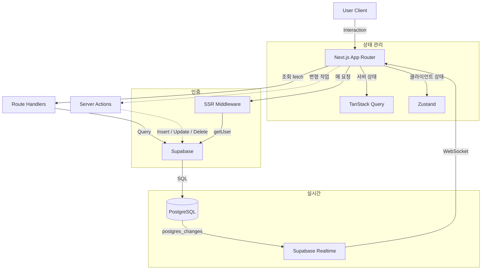
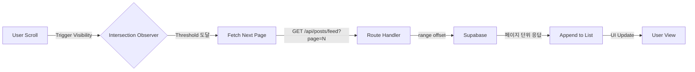
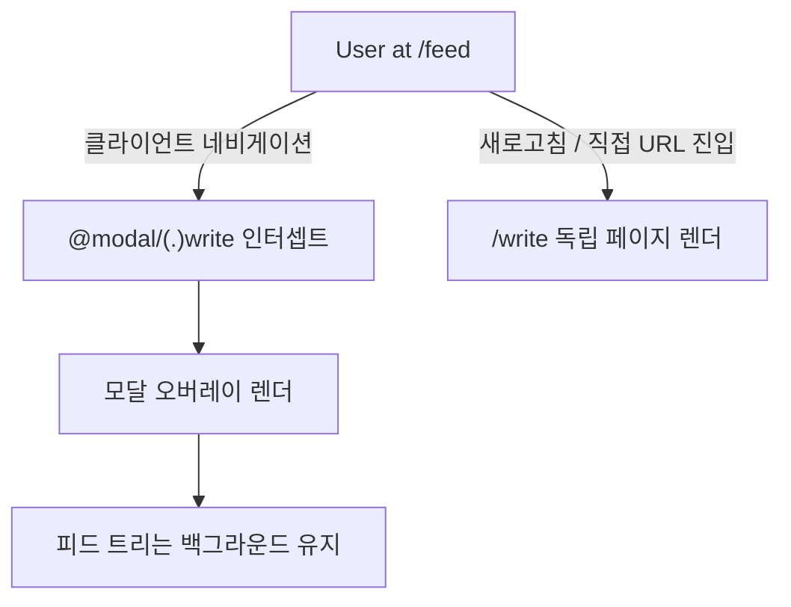
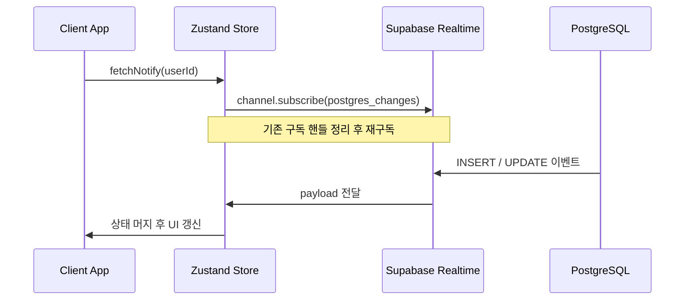

## [xAB] - 실시간 투표 및 소통 중심의 A/B 테스트 SNS

두 선택지에 대한 실시간 투표·댓글 토론이 곧장 반영되는 SNS로, 본인은 4인 FE 팀에 참여해 Next.js App Router 위에서 모달 라우팅·실시간 동기·미들웨어 인증·OAuth 콜백 오리진 복원을 담당했습니다.

### 전체적인 아키텍처

- Next.js App Router 기반 프론트엔드와 Supabase 백엔드를 결합하여 구축했습니다.
- 조회성 요청은 클라이언트 컴포넌트가 Route Handler를 호출해 Supabase에 접근하는 경로로 처리하고, 게시글 작성·수정·삭제 같은 변형 작업은 Server Actions가 Supabase를 직접 호출하도록 두 경로를 명확히 분리했습니다.
- 서버 상태는 TanStack Query, 클라이언트 전역 상태는 Zustand로 책임을 분리하여 실시간성이 중요한 SNS 환경에서도 캐시 일관성과 사용자 인터랙션 상태를 한 흐름에서 관리했습니다.

### Case 1. 피드 초기 로딩 지연을 해소하는 지연 로딩 전략
#### 1. 문제 원인
- 메인 피드 접속 시 게시글, 투표 옵션, 댓글 수, 좋아요 정보를 한 번에 불러오는 구조에서는 첫 화면 진입 시 응답 페이로드와 렌더링 비용이 크게 누적되었습니다.
- 뷰포트 밖에 있는 게시글까지 동일한 비중으로 페칭과 렌더링을 수행하면서 초기 화면이 그려지기까지의 체감 지연이 발생했습니다.

#### 2. 해결 과정

- 사용자가 당장 보지 않는 데이터까지 한 번에 호출하는 대신 피드를 페이지 단위로 분할하여 호출하는 전략을 수립했습니다.
- `useInfiniteQuery`로 페이지네이션 상태를 관리하고, `react-intersection-observer`로 뷰포트 하단 트리거 요소의 노출 시점을 감지해 다음 페이지를 가져오도록 구현했습니다.
- Route Handler는 `page` 쿼리 파라미터를 받아 Supabase의 `.range(offset, offset + limit - 1)` 메서드로 페이지 단위 응답만 반환하도록 구성하여 서버와 클라이언트가 동일한 분할 단위를 공유하게 했습니다.

#### 3. 결과
- 초기 진입 시 필요한 데이터만 우선 응답하도록 변경하여 첫 화면이 그려지기까지의 체감 지연을 완화했습니다.
- 스크롤 위치에 따라 점진적으로 데이터를 채워 사용자의 탐색 흐름이 끊기지 않는 무한 스크롤 경험을 제공했습니다.
- useInfiniteQuery와 IntersectionObserver로 페이지 단위 분할 호출을 적용해 첫 화면 응답 페이로드와 렌더링 비용을 줄였습니다.

### Case 2. 피드 맥락을 유지하는 모달 라우팅 패턴 적용
#### 1. 문제 원인
- 피드에서 게시글 작성이나 상세 화면으로 이동할 때 전체 페이지가 다시 렌더되면서 스크롤 위치와 진행 중이던 인터랙션이 모두 초기화되는 문제가 있었습니다.
- 기존 라우팅 방식은 페이지 컨텍스트를 완전히 교체하기 때문에 이전 화면의 상태를 유지한 채 상호작용할 수 없는 구조적 한계가 원인이었습니다.

#### 2. 해결 과정

- 탐색 흐름을 유지하기 위해 피드 트리는 그대로 두고 그 위에 모달을 띄우는 방식을 채택했습니다.
- Next.js App Router의 병렬 라우트 슬롯(`@modal`)과 인터셉팅 라우트(`(.)write`)를 함께 배치하여, 클라이언트 네비게이션 시에는 모달 오버레이가 렌더되고 직접 URL 진입이나 새로고침 시에는 독립 페이지가 렌더되는 구조를 만들었습니다.
- `@modal/default.tsx`에 빈 슬롯 폴백을 두어 슬롯이 활성화되지 않은 라우트에서도 트리가 흐트러지지 않도록 처리했습니다.

#### 3. 결과
- 게시글 작성과 상세 진입 시 피드 위치와 스크롤 컨텍스트가 보존되어 탐색이 끊기지 않는 경험을 제공했습니다.
- 모달 진입과 독립 페이지 진입을 같은 URL로 처리할 수 있어 공유 링크나 새로고침 시에도 일관된 화면을 유지했습니다.
- @modal 병렬 라우트와 (.)write 인터셉팅 라우트를 결합해 클라이언트 네비게이션은 모달, 직접 URL 진입은 독립 페이지로 갈라지는 흐름을 구성했습니다.

### Case 3. Supabase Realtime을 활용한 라이브 피드 환경 구축
#### 1. 문제 원인
- SNS 특성상 댓글과 투표가 빈번하게 발생하지만, 사용자가 직접 새로고침을 누르기 전까지는 최신 데이터를 확인할 수 없는 정적인 환경이 소통을 저해했습니다.
- 주기적인 폴링 방식은 변화가 없을 때도 호출이 반복되어 서버 부하와 네트워크 비용을 누적시키는 구조적 비효율이 있었습니다.

#### 2. 해결 과정

- 데이터베이스 변경 사항을 클라이언트로 곧장 푸시하기 위해 Supabase Realtime의 `postgres_changes` 이벤트 구독을 도입했습니다.
- 댓글 영역에서는 React Query 캐시 갱신 로직과 연동하여 새 댓글이 도착하면 캐시가 갱신되고 화면이 곧장 반영되도록 구성했습니다.
- 알림 영역에서는 Zustand 스토어가 구독 해제 핸들을 함께 보관하도록 설계하고, 재진입이나 사용자 전환 시 이전 구독을 정리한 뒤 재구독하도록 하여 중복 구독으로 인한 리소스 누수를 방지했습니다.

#### 3. 결과
- 새로고침 없이도 새 댓글과 알림이 곧장 반영되는 라이브 환경을 구현하여 상호작용 응답성을 확보했습니다.
- 폴링 방식을 제거하고 변경 이벤트가 발생할 때만 메시지를 받도록 하여 불필요한 요청을 줄였습니다.
- Zustand 스토어가 구독 해제 핸들을 함께 보관하도록 두어 사용자 전환 시 이전 구독을 정리한 뒤 재구독해 중복 구독 누수를 막았습니다.
